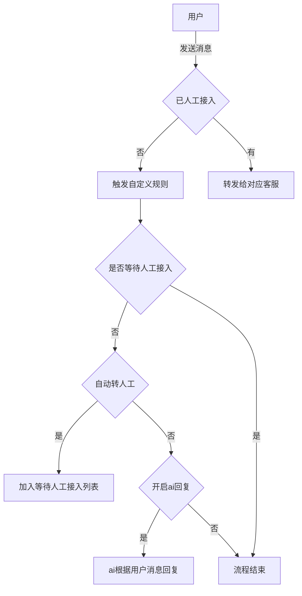

# gochat客服系统

### 介绍
基于goframe(v2)，ant-design-pro，Taro实现的实时客服IM系统，通过websocket实现消息的推送，接口化设计，易于修改。支持集群部署，
集群部署情况下，通过grpc实现不同服务器之间的websocket消息传递发送。


- [客服前端代码](https://github.com/zjwshisb/service-frontend)
- [用户端前端代码](https://github.com/zjwshisb/service-user)

依赖
- mysql
- redis(6+，低版本可能会出现不兼容)
- etcd|polaris|zookeeper(集群部署情况下,默认etcd)


### 开始

#### 本地开发

```shell
git clone https://github.com/zjwshisb/go-chat-service.git
cd go-chat-service
cp manifest/config/config.example.yaml manifest/config/config.yaml # 复制并修改配置文件
go run main.go migrate # 迁移数据结构
go run main.go fake # 假数据填充
go run main.go http # 启动服务
```
详细参考 [goframe](https://goframe.org/)

#### 多环境配置

项目支持 4 个环境的独立配置：

- `dev` - 开发环境
- `fat` - 功能验收测试环境
- `uat` - 用户验收测试环境
- `pro` - 生产环境

**本地开发使用指定环境**:
```bash
# 启动 dev 环境（默认）
go run main.go http

# 启动 fat 环境
go run main.go http -c manifest/config/config.fat.yaml

# 启动 pro 环境
go run main.go http -c manifest/config/config.pro.yaml
```

**Docker 构建指定环境镜像**:
```bash
# 构建 dev 环境镜像
make image

# 构建 pro 环境镜像并指定标签
make image ENV=pro TAG=v1.0.0
```

**快速部署脚本**:
```bash
# 部署 dev 环境
./deploy.sh dev

# 部署 pro 环境（指定版本）
./deploy.sh pro v1.0.0
```

详细说明请参考：
- [完整部署文档](DEPLOYMENT.md)
- [快速开始指南](QUICK_START.md)
- [GitLab CI/CD 部署指南](GITLAB_CI_CD_GUIDE.md)

### 功能

- [x] 文字/表情/图片/音频/视频/pdf消息发送
- [x] 自动回复
- [x] 用户在线状态显示|通知
- [x] 消息已读未读显示|通知(支持配置开关)
- [X] 转接人工(支持排队位置显示|通知，支持配置开关)
- [x] 客服转接
- [x] 文件管理(本地,七牛oss)
- [X] 多租户
- [X] 对接langchaingo

### 逻辑说明



### 演示地址

用户端(移动端): [http://120.77.242.145/mobile](http://120.77.242.145/mobile)  
账号: user(0-19) #user0-user19  
密码: user(0-19) #user1-user19  
客服端(pc): [http://120.77.242.145/server](http://120.77.242.145/server)  
账号: admin(0-19) #admin1-admin19  
密码: admin(0-19) #admin1-admin19

### 更新日志

2025.1.4 使用[GOFRAME](https://github.com/gogf/gf)进行了重构
2025.1.9 支持集群部署
2025.1.19 pdf文件消息
2025.3.26 对接langchiango, 可自定义RAG实现ai回复
2025.12.4 新增多环境配置支持（dev/fat/uat/pro）及 GitLab CI/CD 自动化部署

### LICENSE

MIT
# Build Thu Dec  4 14:14:26 CST 2025
