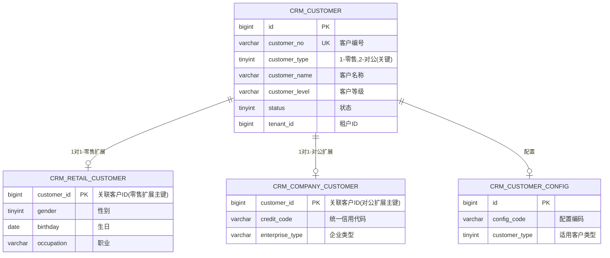

# 客户画像系统数据库设计文档（精简版）

## 📋 文档概述

**项目名称**: 客户画像系统（CRM 360视图）
**文档版本**: v2.0（基于客户信息分析调整）
**编写日期**: 2025-01-24
**数据库**: MySQL 8.0+
**字符集**: utf8mb4
**存储引擎**: InnoDB
**参考文档**: `customer-info-analysis.md`

### 设计特点

- **表数量**: 65张核心表
- **模块数**: 12个功能模块
- **信息分类**: 21项共有信息 + 8项零售特有 + 16项对公特有
- **分区表**: 3张（交易明细、线上行为、统计快照）
- **技术框架**: 基于易诚快速开发平台
- **核心特性**: 多租户隔离、数据权限控制、敏感数据加密

---

## 🎯 设计原则

### 核心策略

基于 `customer-info-analysis.md` 的分析结果，本设计遵循以下原则：

#### 1. 共有信息 - 统一表结构（21项）

```
设计策略: 零售客户和对公客户共有的信息使用统一表结构
实现方式: 通过 customer_type 字段区分零售(1)和对公(2)客户
```

**优点**:
- ✅ 统一管理，避免数据冗余
- ✅ 共有业务逻辑复用
- ✅ 便于跨客户类型统计和分析
- ✅ 简化系统维护

**适用信息**:
- **客户基础层**: 客户概况、标签画像、知识图谱、客户基本信息、管理信息
- **业务数据层**: 账户、产品、授信、签约、担保、交易、信用
- **评价分析层**: 评级、贡献度
- **营销服务层**: 营销活动、需求、产品推荐、接触轨迹
- **行为数据层**: 线上行为、重要事件

#### 2. 特有信息 - 独立扩展表

```
零售客户特有(8项):
├── 个人基础信息: 证件、工作、经营、家庭
├── 个人偏好与权益: 偏好、积分、卡券、礼品
└── 个人管理: 大事记、投诉、提醒

对公客户特有(16项):
├── 企业基础信息(行内): 组织架构、地址、联系人、股票、债券、财务、项目、他行
└── 企业外部信息(行外): 工商、股东、高管、水电费、评级、风险提示、风险、供应链
```

**优点**:
- ✅ 清晰分离零售和对公客户的特有属性
- ✅ 易于维护和扩展各自特有字段
- ✅ 支持不同客户类型的独立业务逻辑
- ✅ 避免主表字段过多

#### 3. 外部数据 - 混合缓存策略

```
策略: 对公客户高度依赖外部数据（工商、股东、风险等）
实现: 本地缓存 + 定期刷新，使用 cache_time 和 expire_time 管理
```

#### 4. 大数据表 - 分区优化

```
策略: 交易、行为、统计等大数据量表使用分区表
实现: 按月 RANGE COLUMNS 分区，支持历史数据归档
```

### 信息分布统计

| 类型 | 信息模块数 | 表数量 | 占比 |
|------|-----------|-------|------|
| **共有信息** | 21项 | 37张 | 56.9% |
| **零售客户特有** | 8项 | 12张 | 18.5% |
| **对公客户特有** | 16项 | 15张 | 23.1% |
| **配置管理** | - | 1张 | 1.5% |
| **总计** | 45项 | **65张** | **100%** |

---

## 🏗️ 整体架构

### 模块划分

| 模块 | 表数量 | 信息类型 | 说明 |
|------|--------|---------|------|
| **客户主体层** | 1 | 共有 | 客户主表（零售+对公统一） |
| **配置管理层** | 1 | 共有 | 客户视图配置表 |
| **客户管理层** | 3 | 🔄 共有 | 归属管理、转移记录、历史（零售+对公共用） |
| **业务数据层** | 10 | 🔄 共有 | 账户、产品、授信、签约、担保、交易（零售+对公共用） |
| **客户评价层** | 5 | 🔄 共有 | 评级、评级历史、贡献度、信用（零售+对公共用） |
| **营销服务层（共有）** | 5 | 🔄 共有 | 营销活动、需求、接触轨迹、营销计划、营销效果 |
| **营销服务层（零售特有）** | 3 | 👤 零售特有 | 投诉、提醒、产品推荐（主要针对零售） |
| **行为数据层** | 3 | 🔄 共有 | 线上行为、重要事件、统计快照（零售+对公共用） |
| **关系网络层** | 2 | 🔄 共有 | 知识图谱类型、客户关系（零售+对公共用） |
| **标签体系层** | 3 | 🔄 共有 | 标签分类、标签、客户标签（零售+对公共用） |
| **零售客户特有层** | 12 | 👤 零售特有 | 扩展表、证件、工作、经营、家庭、成员、偏好、大事记、积分、卡券、礼品、订单 |
| **对公客户特有层** | 15 | 🏢 对公特有 | 扩展表、组织架构、地址、联系人、股票、债券、财务、项目、他行、工商、股东、高管、水电费、评级、风险、供应链 |
| **总计** | **65** | - | **37张共有 + 12张零售特有 + 15张对公特有 + 1张配置** |

### 信息类型图例

- 🔄 **共有信息**: 零售客户和对公客户共用，通过 `customer_type` 字段区分
- 👤 **零售特有**: 仅适用于个人客户（customer_type=1）
- 🏢 **对公特有**: 仅适用于企业客户（customer_type=2）

### 技术选型

```yaml
数据库: MySQL 8.0+
ORM: MyBatis Plus 3.5.14
缓存: Redis 6.0+
同步策略: 实时/准实时同步
大数据表: 分区表（按月）
统计优化: 定时快照
外部数据: 混合缓存（本地+实时刷新）
```

---

## 📊 ER图（完整实体关系）

### 完整实体关系图（All 65 Tables）

由于包含 65 张表，为保持清晰度，ER 图按以下方式组织：
- **第一部分**: 核心主表和扩展关系
- **第二部分**: 共有信息表（客户管理、业务数据、评价）
- **第三部分**: 共有信息表（营销服务、关系网络、行为数据）
- **第四部分**: 零售客户特有表
- **第五部分**: 对公客户特有表

#### 第一部分：核心主表和扩展关系



#### 第二部分：共有信息表 - 客户管理、业务数据、评价

```mermaid
erDiagram
    %% ============================================
    %% 客户管理层（共有-3张）
    %% ============================================
    CRM_CUSTOMER ||--o{ CRM_CUSTOMER_ASSIGNMENT : "1对多-归属"
    CRM_CUSTOMER_ASSIGNMENT ||--o{ CRM_CUSTOMER_ASSIGNMENT_HISTORY : "1对多-归属历史"
    CRM_CUSTOMER_ASSIGNMENT ||--o{ CRM_CUSTOMER_ASSIGNMENT_TRANSFER : "1对多-归属转移"

    %% ============================================
    %% 业务数据层（共有-10张）
    %% ============================================
    CRM_CUSTOMER ||--o{ CRM_CUSTOMER_ACCOUNT : "1对多-账户"
    CRM_CUSTOMER ||--o{ CRM_CUSTOMER_PRODUCT : "1对多-产品"
    CRM_CUSTOMER ||--o{ CRM_CUSTOMER_CREDIT : "1对多-授信"
    CRM_CUSTOMER ||--o{ CRM_CUSTOMER_CONTRACT : "1对多-签约"
    CRM_CUSTOMER ||--o{ CRM_CUSTOMER_GUARANTEE : "1对多-担保"

    CRM_CUSTOMER_ACCOUNT ||--o{ CRM_CUSTOMER_TRANSACTION : "1对多-交易(分区)"
    CRM_CUSTOMER_ACCOUNT ||--o{ CRM_CUSTOMER_ACCOUNT_FLOW : "1对多-流水快照"

    CRM_CUSTOMER_CREDIT ||--o{ CRM_CUSTOMER_CREDIT_DETAIL : "1对多-授信明细"
    CRM_CUSTOMER_CONTRACT ||--o{ CRM_CUSTOMER_CONTRACT_PRODUCT : "1对多-签约产品"
    CRM_CUSTOMER_GUARANTEE ||--o{ CRM_CUSTOMER_GUARANTEE_ITEM : "1对多-担保明细"

    %% ============================================
    %% 客户评价层（共有-5张）
    %% ============================================
    CRM_CUSTOMER ||--o{ CRM_CUSTOMER_RATING : "1对多-评级"
    CRM_CUSTOMER ||--o{ CRM_CUSTOMER_CONTRIBUTION : "1对多-贡献度"
    CRM_CUSTOMER ||--o{ CRM_CUSTOMER_CREDIT_INFO : "1对多-信用"

    CRM_CUSTOMER_RATING ||--o{ CRM_CUSTOMER_RATING_HISTORY : "1对多-评级历史"
    CRM_CUSTOMER_CONTRIBUTION ||--o{ CRM_CUSTOMER_CONTRIBUTION_DETAIL : "1对多-贡献明细"

    %% 实体定义
    CRM_CUSTOMER {
        bigint id PK
        varchar customer_no UK
        tinyint customer_type
    }

    CRM_CUSTOMER_ASSIGNMENT {
        bigint id PK
        bigint customer_id FK
        tinyint assignment_type "1-主办,2-协办"
    }

    CRM_CUSTOMER_ACCOUNT {
        bigint id PK
        bigint customer_id FK
        int account_type
        varchar account_no UK
    }

    CRM_CUSTOMER_TRANSACTION {
        bigint id PK
        bigint account_id FK
        datetime transaction_time "分区字段"
    }

    CRM_CUSTOMER_RATING {
        bigint id PK
        bigint customer_id FK
        varchar rating_level
    }

    CRM_CUSTOMER_CONTRIBUTION {
        bigint id PK
        bigint customer_id FK
        decimal total_contribution
    }
```



#### 第三部分：共有信息表 - 营销服务、关系网络、行为数据

```mermaid
erDiagram
    %% ============================================
    %% 营销服务层（共有-5张+零售特有3张）
    %% ============================================
    CRM_CUSTOMER ||--o{ CRM_CUSTOMER_MARKETING : "1对多-营销活动(共有)"
    CRM_CUSTOMER ||--o{ CRM_CUSTOMER_DEMAND : "1对多-需求(共有)"
    CRM_CUSTOMER ||--o{ CRM_CUSTOMER_CONTACT_RECORD : "1对多-接触轨迹(共有)"
    CRM_CUSTOMER ||--o{ CRM_CUSTOMER_MARKETING_PLAN : "1对多-营销计划(共有)"
    CRM_CUSTOMER ||--o{ CRM_CUSTOMER_MARKETING_EFFECT : "1对多-营销效果(共有)"

    CRM_CUSTOMER ||--o{ CRM_PRODUCT_RECOMMEND : "1对多-产品推荐(共有)"
    CRM_CUSTOMER ||--o{ CRM_CUSTOMER_COMPLAINT : "1对多-投诉(零售为主)"
    CRM_CUSTOMER ||--o{ CRM_CUSTOMER_REMINDER : "1对多-提醒(零售为主)"

    %% ============================================
    %% 关系网络层（共有-5张）
    %% ============================================
    CRM_CUSTOMER_RELATION_TYPE ||--o{ CRM_CUSTOMER_RELATION : "1对多-关系"
    CRM_CUSTOMER ||--o{ CRM_CUSTOMER_RELATION : "1对多-客户关系"

    CRM_TAG_CATEGORY ||--o{ CRM_TAG : "1对多-标签"
    CRM_TAG ||--o{ CRM_CUSTOMER_TAG : "1对多-客户标签"
    CRM_CUSTOMER ||--o{ CRM_CUSTOMER_TAG : "1对多-标签关联"

    %% ============================================
    %% 行为数据层（共有-3张）
    %% ============================================
    CRM_CUSTOMER ||--o{ CRM_CUSTOMER_ONLINE_BEHAVIOR : "1对多-线上行为(分区)"
    CRM_CUSTOMER ||--o{ CRM_CUSTOMER_IMPORTANT_EVENT : "1对多-重要事件"
    CRM_CUSTOMER ||--o{ CRM_CUSTOMER_STATISTICS_SNAPSHOT : "1对多-统计快照(分区)"

    %% 实体定义
    CRM_CUSTOMER {
        bigint id PK
        varchar customer_no UK
    }

    CRM_CUSTOMER_MARKETING {
        bigint id PK
        bigint customer_id FK
        bigint activity_id
    }

    CRM_CUSTOMER_TAG {
        bigint id PK
        bigint customer_id FK
        bigint tag_id FK
        tinyint tag_source "1-系统,2-人工"
    }

    CRM_TAG_CATEGORY {
        bigint id PK
        varchar category_name
    }

    CRM_TAG {
        bigint id PK
        bigint category_id FK
        varchar tag_name
    }

    CRM_CUSTOMER_RELATION {
        bigint id PK
        bigint customer_id FK "客户A"
        bigint related_customer_id "客户B"
        bigint relation_type_id FK
    }

    CRM_CUSTOMER_ONLINE_BEHAVIOR {
        bigint id PK
        bigint customer_id FK
        datetime behavior_time "分区字段"
    }
```



#### 第四部分：零售客户特有表（12张）

```mermaid
erDiagram
    %% ============================================
    %% 零售客户特有 - 个人基础信息（4张）
    %% ============================================
    CRM_RETAIL_CUSTOMER ||--o{ CRM_CUSTOMER_IDENTITY : "1对多-证件"
    CRM_RETAIL_CUSTOMER ||--o{ CRM_CUSTOMER_WORK : "1对多-工作"
    CRM_RETAIL_CUSTOMER ||--o{ CRM_CUSTOMER_BUSINESS : "1对多-经营"

    %% ============================================
    %% 零售客户特有 - 家庭信息（2张）
    %% ============================================
    CRM_RETAIL_CUSTOMER ||--|| CRM_CUSTOMER_FAMILY : "1对1-家庭"
    CRM_CUSTOMER_FAMILY ||--o{ CRM_CUSTOMER_FAMILY_MEMBER : "1对多-家庭成员"

    %% ============================================
    %% 零售客户特有 - 个人偏好与管理（2张）
    %% ============================================
    CRM_RETAIL_CUSTOMER ||--|| CRM_CUSTOMER_PREFERENCE : "1对1-偏好"
    CRM_RETAIL_CUSTOMER ||--o{ CRM_CUSTOMER_EVENT : "1对多-大事记"

    %% ============================================
    %% 零售客户特有 - 权益积分（4张）
    %% ============================================
    CRM_RETAIL_CUSTOMER ||--|| CRM_CUSTOMER_POINTS : "1对1-积分"
    CRM_RETAIL_CUSTOMER ||--o{ CRM_CUSTOMER_COUPON : "1对多-卡券"
    CRM_RETAIL_CUSTOMER ||--o{ CRM_CUSTOMER_GIFT : "1对多-礼品"
    CRM_RETAIL_CUSTOMER ||--o{ CRM_CUSTOMER_GIFT_ORDER : "1对多-礼品订单"

    %% 实体定义
    CRM_RETAIL_CUSTOMER {
        bigint customer_id PK "主键-关联客户ID"
        tinyint gender
        date birthday
    }

    CRM_CUSTOMER_IDENTITY {
        bigint id PK
        bigint customer_id FK
        varchar identity_type
        varchar identity_no "加密"
    }

    CRM_CUSTOMER_FAMILY {
        bigint customer_id PK "主键-关联客户ID"
        int family_member_count
        decimal family_annual_income
    }

    CRM_CUSTOMER_FAMILY_MEMBER {
        bigint id PK
        bigint family_id FK
        varchar member_name
        varchar relation_type
    }

    CRM_CUSTOMER_PREFERENCE {
        bigint customer_id PK "主键-关联客户ID"
        tinyint risk_preference
        varchar hobbies
    }

    CRM_CUSTOMER_POINTS {
        bigint customer_id PK "主键-关联客户ID"
        int total_points
        int available_points
    }

    CRM_CUSTOMER_COUPON {
        bigint id PK
        bigint customer_id FK
        varchar coupon_code
        date expire_date
    }
```



#### 第五部分：对公客户特有表（15张）

```mermaid
erDiagram
    %% ============================================
    %% 对公客户特有 - 企业基础信息-行内（8张）
    %% ============================================
    CRM_COMPANY_CUSTOMER ||--o{ CRM_COMPANY_ORGANIZATION : "1对多-组织架构"
    CRM_COMPANY_CUSTOMER ||--o{ CRM_COMPANY_ADDRESS : "1对多-地址"
    CRM_COMPANY_CUSTOMER ||--o{ CRM_COMPANY_CONTACT : "1对多-联系人"
    CRM_COMPANY_CUSTOMER ||--o{ CRM_COMPANY_STOCK : "1对多-股票"
    CRM_COMPANY_CUSTOMER ||--o{ CRM_COMPANY_BOND : "1对多-债券"
    CRM_COMPANY_CUSTOMER ||--o{ CRM_COMPANY_FINANCE : "1对多-财务"
    CRM_COMPANY_CUSTOMER ||--o{ CRM_COMPANY_PROJECT : "1对多-项目"
    CRM_COMPANY_CUSTOMER ||--o{ CRM_COMPANY_OTHER_BANK : "1对多-他行"

    %% ============================================
    %% 对公客户特有 - 企业外部信息-行外（7张）
    %% ============================================
    CRM_COMPANY_CUSTOMER ||--|| CRM_COMPANY_EXTERNAL : "1对1-外部数据汇总"

    CRM_COMPANY_EXTERNAL ||--o{ CRM_COMPANY_BUSINESS_INFO : "1对多-工商"
    CRM_COMPANY_EXTERNAL ||--o{ CRM_COMPANY_SHAREHOLDER : "1对多-股东"
    CRM_COMPANY_EXTERNAL ||--o{ CRM_COMPANY_EXECUTIVE : "1对多-高管"
    CRM_COMPANY_EXTERNAL ||--o{ CRM_COMPANY_UTILITY : "1对多-水电费"
    CRM_COMPANY_EXTERNAL ||--o{ CRM_COMPANY_RATING_EXTERNAL : "1对多-外部评级"
    CRM_COMPANY_EXTERNAL ||--o{ CRM_COMPANY_RISK_ALERT : "1对多-风险提示"
    CRM_COMPANY_EXTERNAL ||--o{ CRM_COMPANY_RISK_INFO : "1对多-风险信息"
    CRM_COMPANY_EXTERNAL ||--o{ CRM_COMPANY_SUPPLY_CHAIN : "1对多-供应链"

    %% 实体定义
    CRM_COMPANY_CUSTOMER {
        bigint customer_id PK "主键-关联客户ID"
        varchar credit_code "统一信用代码"
        decimal registered_capital
    }

    CRM_COMPANY_ORGANIZATION {
        bigint id PK
        bigint customer_id FK
        bigint parent_id "上级组织"
        varchar org_name
    }

    CRM_COMPANY_ADDRESS {
        bigint id PK
        bigint customer_id FK
        tinyint address_type
        varchar address
    }

    CRM_COMPANY_CONTACT {
        bigint id PK
        bigint customer_id FK
        varchar contact_name
        varchar position
    }

    CRM_COMPANY_FINANCE {
        bigint id PK
        bigint customer_id FK
        int fiscal_year
        json balance_sheet "资产负债表"
        json profit_statement "利润表"
    }

    CRM_COMPANY_EXTERNAL {
        bigint customer_id PK "主键-关联客户ID"
        datetime cache_time "缓存时间"
        datetime expire_time "过期时间"
    }

    CRM_COMPANY_BUSINESS_INFO {
        bigint id PK
        bigint external_id FK
        varchar legal_person "法人"
        date establish_date
    }

    CRM_COMPANY_SHAREHOLDER {
        bigint id PK
        bigint external_id FK
        varchar shareholder_name
        decimal shareholding_ratio
    }

    CRM_COMPANY_RISK_INFO {
        bigint id PK
        bigint external_id FK
        varchar risk_type
        datetime risk_date
    }

    CRM_COMPANY_SUPPLY_CHAIN {
        bigint id PK
        bigint external_id FK
        tinyint chain_type "1-上游,2-下游"
        varchar related_company
    }
```



### ER 图说明

#### 设计特点

1. **分层结构**：
   - **核心层**: 客户主表（CRM_CUSTOMER）通过 `customer_type` 字段区分零售/对公
   - **扩展层**: 零售扩展表（CRM_RETAIL_CUSTOMER）和对公扩展表（CRM_COMPANY_CUSTOMER）
   - **共有信息层**: 37张表直接关联客户主表，零售和对公共用
   - **特有信息层**: 12张零售特有表 + 15张对公特有表

2. **关键关系**：
   - **1对1关系**: 客户主表 ↔ 扩展表（通过 `customer_id` 唯一关联）
   - **1对多关系**: 客户主表 → 共有信息表（如账户、产品、交易等）
   - **多对多关系**: 客户 ↔ 标签（通过 CRM_CUSTOMER_TAG 关联表）
   - **自关联**: 客户关系表（CRM_CUSTOMER_RELATION）构建知识图谱

3. **分区表标注**：
   - `crm_customer_transaction` - 交易明细表（按 客户 ID 分区）
   - `crm_customer_online_behavior` - 线上行为表（按 客户 ID 分区）
   - `crm_customer_statistics_snapshot` - 统计快照表（按 客户 ID 分区）

4. **外部数据管理**：
   - 对公客户的外部数据（工商、股东、风险等）统一通过 `CRM_COMPANY_EXTERNAL` 汇总表管理
   - 包含 `cache_time` 和 `expire_time` 字段，支持缓存过期管理

5. **多租户支持**：
   - 所有表（通过 BaseDO）都包含 `tenant_id` 字段，支持多租户隔离
   - 零售和对公客户在同一租户下统一管理

---

## 📊 业务模块与数据库表映射关系

本节根据 `huaxiang.txt` 业务需求文档，梳理客户360视图各业务模块与数据库表的对应关系，方便业务人员和开发人员快速定位相关表。

### 业务模块与表名对照表

| 类别 | 模块 | 表名 | 备注 |
|------|------|------|------|
| **零售客户360视图** | 客户概况 | `crm_customer`<br>`crm_retail_customer`<br>`crm_customer_business_summary`<br>`crm_customer_aum_trend`<br>`crm_customer_product_stat` | 客户主表+扩展表+统计表组合展示<br>包含客户基本信息、AUM趋势、产品统计等 |
| 零售客户360视图 | 标签画像 | `crm_customer_tag`<br>`crm_tag`<br>`crm_tag_category` | 标签体系：分类->标签->客户关联<br>支持系统打标和人工打标 |
| 零售客户360视图 | 知识图谱 | `crm_customer_relation`<br>`crm_customer_relation_type` | 客户关系网络<br>支持家庭、家族、村社等关系 |
| 零售客户360视图 | 客户基本信息 | `crm_retail_customer` | 个人客户基础属性<br>性别、年龄、学历、职业等 |
| 零售客户360视图 | 客户证件信息 | `crm_customer_identity` | 多证件管理<br>支持身份证、护照、驾驶证等 |
| 零售客户360视图 | 客户工作或经营信息 | `crm_customer_work`<br>`crm_customer_business` | 在职信息+经营主体信息 |
| 零售客户360视图 | 客户家庭信息 | `crm_customer_family`<br>`crm_customer_family_member` | 家庭概况+家庭成员详情 |
| 零售客户360视图 | 管理信息 | `crm_customer_assignment`<br>`crm_customer_assignment_history`<br>`crm_customer_assignment_transfer` | 客户归属管理<br>支持主协办模式、归属历史追踪 |
| 零售客户360视图 | 客户大事记信息 | `crm_customer_event` | 客户重大事件台账 |
| 零售客户360视图 | 客户偏好 | `crm_customer_preference` | 兴趣爱好、投资偏好等 |
| 零售客户360视图 | 客户业务概览 | `crm_customer_account`<br>`crm_customer_product`<br>`crm_customer_business_summary`<br>`crm_customer_aum_trend`<br>`crm_customer_fund_flow` | 资产负债概况<br>包含账户、产品、AUM、资金流向 |
| 零售客户360视图 | 账户信息 | `crm_customer_account`<br>`crm_customer_account_flow` | 存款、贷款、理财、信用卡等账户<br>支持账户流水查询 |
| 零售客户360视图 | 产品持有信息 | `crm_customer_product`<br>`crm_customer_product_stat` | 产品持有明细+产品统计 |
| 零售客户360视图 | 担保信息 | `crm_customer_guarantee`<br>`crm_customer_guarantee_item` | 抵押、质押、保证等担保信息 |
| 零售客户360视图 | 客户授信信息 | `crm_customer_credit`<br>`crm_customer_credit_detail` | 授信额度、用信情况 |
| 零售客户360视图 | 签约信息 | `crm_customer_contract`<br>`crm_customer_contract_product` | 各类签约协议及签约产品 |
| 零售客户360视图 | 交易明细信息 | `crm_customer_transaction` | **分区表**，按月分区<br>近30天交易流水 |
| 零售客户360视图 | 客户评级信息 | `crm_customer_rating`<br>`crm_customer_rating_history` | 综合评级+评级历史 |
| 零售客户360视图 | 客户贡献度信息 | `crm_customer_contribution`<br>`crm_customer_contribution_detail` | 综合贡献度+贡献度明细 |
| 零售客户360视图 | 客户信用信息 | `crm_customer_credit_info`<br>`crm_customer_credit_score` | 信用卡、逾期等信用信息 |
| 零售客户360视图 | 客户投诉信息 | `crm_customer_complaint` | **零售特有**<br>各渠道投诉整合 |
| 零售客户360视图 | 客户营销信息 | `crm_customer_marketing`<br>`crm_customer_marketing_plan`<br>`crm_customer_marketing_effect` | 营销活动+营销计划+营销效果 |
| 零售客户360视图 | 客户需求信息 | `crm_customer_demand` | 各渠道客户需求整合 |
| 零售客户360视图 | 客户提醒信息 | `crm_customer_reminder` | **零售特有**<br>系统提醒信息 |
| 零售客户360视图 | 客户接触轨迹 | `crm_customer_contact_record` | 拜访、通话、短信等接触记录 |
| 零售客户360视图 | 产品推荐 | `crm_product_recommend` | AI推荐产品+热销产品 |
| 零售客户360视图 | 客户权益积分信息 | `crm_customer_points`<br>`crm_customer_points_detail`<br>`crm_customer_coupon`<br>`crm_customer_gift`<br>`crm_customer_gift_order` | **零售特有**<br>积分、卡券、礼品、礼品订单 |
| 零售客户360视图 | 线上渠道行为信息 | `crm_customer_online_behavior` | **分区表**，按月分区<br>手机银行、网银等渠道行为 |
| 零售客户360视图 | 客户重要事件 | `crm_customer_important_event` | 首次开户、等级升降等重要业务事件 |
| **对公客户360视图（行内）** | 客户概况 | `crm_customer`<br>`crm_company_customer`<br>`crm_customer_business_summary`<br>`crm_customer_aum_trend` | 客户主表+扩展表+统计表组合展示 |
| 对公客户360视图（行内） | 标签画像 | `crm_customer_tag`<br>`crm_tag`<br>`crm_tag_category` | 标签体系（零售对公共用） |
| 对公客户360视图（行内） | 知识图谱 | `crm_customer_relation`<br>`crm_customer_relation_type` | 企业关系网络<br>支持股东、关联企业、上下游等 |
| 对公客户360视图（行内） | 客户基本信息 | `crm_company_customer` | 企业客户基础属性<br>统一信用代码、行业分类、注册资本等 |
| 对公客户360视图（行内） | 组织架构信息 | `crm_company_organization` | 树形结构<br>支持集团、分公司、子公司 |
| 对公客户360视图（行内） | 客户地址信息 | `crm_company_address` | 多地址管理<br>注册、经营、办公地址等 |
| 对公客户360视图（行内） | 联系人信息 | `crm_company_contact` | 分类联系人<br>支持主联系人、决策人标识 |
| 对公客户360视图（行内） | 股票发行人信息 | `crm_company_stock` | 上市公司股票信息 |
| 对公客户360视图（行内） | 债券发行信息 | `crm_company_bond` | 债券发行情况 |
| 对公客户360视图（行内） | 客户财务信息 | `crm_company_finance` | **对公特有**<br>资产负债表、利润表、现金流量表<br>支持JSON存储完整财务数据 |
| 对公客户360视图（行内） | 客户项目信息 | `crm_company_project` | 企业项目台账 |
| 对公客户360视图（行内） | 管理信息 | `crm_customer_assignment`<br>`crm_customer_assignment_history`<br>`crm_customer_assignment_transfer` | 客户归属管理（零售对公共用） |
| 对公客户360视图（行内） | 客户他行信息 | `crm_company_other_bank` | **对公特有**<br>与其他银行合作信息台账 |
| 对公客户360视图（行内） | 客户业务概览 | `crm_customer_account`<br>`crm_customer_product`<br>`crm_customer_business_summary`<br>`crm_customer_fund_flow` | 业务数据统一管理（零售对公共用） |
| 对公客户360视图（行内） | 账户信息 | `crm_customer_account`<br>`crm_customer_account_flow` | 业务数据统一管理（零售对公共用） |
| 对公客户360视图（行内） | 产品持有信息 | `crm_customer_product`<br>`crm_customer_product_stat` | 业务数据统一管理（零售对公共用） |
| 对公客户360视图（行内） | 授信信息 | `crm_customer_credit`<br>`crm_customer_credit_detail` | 业务数据统一管理（零售对公共用） |
| 对公客户360视图（行内） | 签约信息 | `crm_customer_contract`<br>`crm_customer_contract_product` | 业务数据统一管理（零售对公共用） |
| 对公客户360视图（行内） | 担保信息 | `crm_customer_guarantee`<br>`crm_customer_guarantee_item` | 业务数据统一管理（零售对公共用） |
| 对公客户360视图（行内） | 交易明细信息 | `crm_customer_transaction` | **分区表**（零售对公共用） |
| 对公客户360视图（行内） | 客户评级信息 | `crm_customer_rating`<br>`crm_customer_rating_history` | 评价数据统一管理（零售对公共用） |
| 对公客户360视图（行内） | 客户贡献度信息 | `crm_customer_contribution`<br>`crm_customer_contribution_detail` | 评价数据统一管理（零售对公共用） |
| 对公客户360视图（行内） | 客户信用信息 | `crm_customer_credit_info`<br>`crm_customer_credit_score` | 评价数据统一管理（零售对公共用） |
| 对公客户360视图（行内） | 客户营销信息 | `crm_customer_marketing`<br>`crm_customer_marketing_plan`<br>`crm_customer_marketing_effect` | 营销数据统一管理（零售对公共用） |
| 对公客户360视图（行内） | 客户需求信息 | `crm_customer_demand` | 营销数据统一管理（零售对公共用） |
| 对公客户360视图（行内） | 产品推荐 | `crm_product_recommend` | 营销数据统一管理（零售对公共用） |
| 对公客户360视图（行内） | 线上渠道行为信息 | `crm_customer_online_behavior` | **分区表**<br>企业网银等渠道行为 |
| 对公客户360视图（行内） | 客户接触轨迹 | `crm_customer_contact_record` | 营销数据统一管理（零售对公共用） |
| 对公客户360视图（行内） | 客户重要事件 | `crm_customer_important_event` | 行为数据统一管理（零售对公共用） |
| **对公客户360视图（行外）** | 工商信息 | `crm_company_business_info` | **外部数据**<br>企业工商信息+变更记录<br>支持缓存过期管理 |
| 对公客户360视图（行外） | 股东信息 | `crm_company_shareholder` | **外部数据**<br>股东结构信息 |
| 对公客户360视图（行外） | 实控人与高管信息 | `crm_company_executive` | **外部数据**<br>高管信息 |
| 对公客户360视图（行外） | 水电费信息 | `crm_company_utility` | **外部数据**<br>企业经营活跃度参考 |
| 对公客户360视图（行外） | 评级信息 | `crm_company_rating_external` | **外部数据**<br>外部评级机构评级 |
| 对公客户360视图（行外） | 风险提示 | `crm_company_risk_alert` | **外部数据**<br>风险预警信息 |
| 对公客户360视图（行外） | 风险信息 | `crm_company_risk_info` | **外部数据**<br>行政处罚、裁判文书、失信被执行等 |
| 对公客户360视图（行外） | 供应链信息 | `crm_company_supply_chain` | **外部数据**<br>供应链上下游企业 |

### 映射关系说明

#### 1. 共有信息表的使用

以下类型的业务模块，零售客户和对公客户使用**相同的表**，通过 `customer_type` 字段区分：

- ✅ **客户管理**：归属、转移、历史
- ✅ **业务数据**：账户、产品、授信、签约、担保、交易
- ✅ **客户评价**：评级、贡献度、信用
- ✅ **营销服务**：营销活动、需求、接触轨迹、产品推荐
- ✅ **关系网络**：知识图谱、标签体系
- ✅ **行为数据**：线上行为、重要事件、统计快照

**好处**：统一管理、业务逻辑复用、便于跨客户类型统计

#### 2. 零售客户特有模块（8项）

以下模块**仅适用于零售客户** (`customer_type=1`)，使用独立扩展表：

- 👤 证件信息
- 👤 工作或经营信息
- 👤 家庭信息
- 👤 客户偏好
- 👤 大事记信息
- 👤 投诉信息（主要）
- 👤 提醒信息（主要）
- 👤 权益积分信息（积分、卡券、礼品）

**特点**：个人属性、家庭关系、权益管理

#### 3. 对公客户特有模块（16项）

以下模块**仅适用于对公客户** (`customer_type=2`)，使用独立扩展表：

**行内数据（8项）**：
- 🏢 组织架构信息
- 🏢 客户地址信息
- 🏢 联系人信息
- 🏢 股票发行人信息
- 🏢 债券发行信息
- 🏢 客户财务信息
- 🏢 客户项目信息
- 🏢 客户他行信息

**行外数据（8项，外部采购）**：
- 🌐 工商信息
- 🌐 股东信息
- 🌐 实控人与高管信息
- 🌐 水电费信息
- 🌐 评级信息
- 🌐 风险提示
- 🌐 风险信息
- 🌐 供应链信息

**特点**：企业结构、财务分析、外部数据整合

#### 4. 分区表标识

以下表为**分区表**（按月分区），需要特别注意查询和维护：

- 📅 `crm_customer_transaction` - 交易明细表
- 📅 `crm_customer_online_behavior` - 线上渠道行为表
- 📅 `crm_customer_statistics_snapshot` - 统计快照表

**查询优化**：WHERE 条件必须包含分区键（时间字段）才能分区裁剪

#### 5. 外部数据表

对公客户的8项行外数据使用**混合缓存策略**：

```sql
-- 外部数据表包含缓存管理字段
cache_time DATETIME COMMENT '缓存时间'
expire_time DATETIME COMMENT '过期时间'
data_source VARCHAR(50) COMMENT '数据来源'
refresh_status TINYINT COMMENT '刷新状态'
```

**策略**：本地缓存 + 定期刷新，支持缓存过期自动更新

### 不在360视图业务模块中的表

在数据库设计的65张表中，以下表**没有在上述业务模块对照表中出现**，属于**系统配置表或后台辅助表**：

| 表名 | 用途 | 说明 |
|------|------|------|
| `crm_customer_config` | 客户视图配置表 | 系统配置表，用于配置简版视图、支行版视图、全行版视图等<br>不直接在360视图展示 |
| `crm_customer_statistics_snapshot` | 客户统计快照表 | **分区表**<br>后台定时任务生成的统计快照数据<br>用于提升查询性能，不直接在360视图展示 |
| `crm_company_external` | 对公客户外部数据汇总表 | 外部数据管理的中间表<br>用于统一管理外部数据的缓存时间和过期时间<br>不直接在360视图展示，通过关联的具体外部数据表展示 |

**说明**：

1. **crm_customer_config** - 这是系统配置表，用于管理不同的客户视图配置（如简版、全行版），不属于具体的业务数据展示模块。

2. **crm_customer_statistics_snapshot** - 这是后台统计表，由定时任务按日/周/月生成统计快照，用于加速统计数据的查询，但不直接在360视图中作为独立模块展示。实际展示时会从其他统计表（如 `crm_customer_business_summary`、`crm_customer_aum_trend` 等）读取数据。

3. **crm_company_external** - 这是对公客户外部数据的汇总管理表，主要用于管理外部数据的缓存策略（cache_time、expire_time），具体的外部数据通过关联的8张外部数据表（工商信息、股东信息等）展示。

**其余62张表**均已在"业务模块与表名对照表"中完整映射，包括：
- ✅ **主数据表**：直接对应业务模块
- ✅ **扩展表**：作为业务模块的一部分展示
- ✅ **字典表**：作为业务模块的组成部分（如标签分类、标签、关系类型）
- ✅ **明细表**：作为业务模块的明细数据（如积分明细、授信明细、担保明细）
- ✅ **历史表**：作为业务模块的历史追溯（如评级历史、归属历史）
- ✅ **统计表**：作为业务模块的统计数据展示（如业务概览统计、AUM趋势、产品统计）

---

## 📚 表分类索引（按信息类型）

基于 `customer-info-analysis.md` 的分析结果，按信息类型对所有 65 张表进行分类索引。

### 🔄 共有信息表（37张）

#### 客户主表（1张）
1. `crm_customer` - 客户主表

#### 客户管理（3张）
2. `crm_customer_assignment` - 客户归属表
3. `crm_customer_assignment_history` - 归属历史表
4. `crm_customer_assignment_transfer` - 归属转移记录表

#### 业务数据（10张）
5. `crm_customer_account` - 客户账户信息表
6. `crm_customer_product` - 客户产品持有表
7. `crm_customer_credit` - 客户授信信息表
8. `crm_customer_contract` - 客户签约信息表
9. `crm_customer_guarantee` - 客户担保信息表
10. `crm_customer_guarantee_item` - 担保明细表
11. `crm_customer_transaction` - 客户交易明细表（分区表）
12. `crm_customer_credit_detail` - 授信明细表
13. `crm_customer_contract_product` - 签约产品关联表
14. `crm_customer_account_flow` - 账户流水快照表

#### 客户评价（5张）
15. `crm_customer_rating` - 客户评级表
16. `crm_customer_rating_history` - 评级历史表
17. `crm_customer_contribution` - 客户贡献度表
18. `crm_customer_contribution_detail` - 贡献度明细表
19. `crm_customer_credit_info` - 客户信用信息表

#### 营销服务（5张）
20. `crm_customer_marketing` - 客户营销活动表
21. `crm_customer_demand` - 客户需求表
22. `crm_customer_contact_record` - 客户接触轨迹表
23. `crm_customer_marketing_plan` - 客户营销计划表
24. `crm_customer_marketing_effect` - 客户营销效果表

#### 关系网络（5张）
25. `crm_customer_relation_type` - 客户关系类型表
26. `crm_customer_relation` - 客户关系表
27. `crm_tag_category` - 标签分类表
28. `crm_tag` - 标签表
29. `crm_customer_tag` - 客户标签关联表

#### 行为数据（3张）
30. `crm_customer_online_behavior` - 线上渠道行为表（分区表）
31. `crm_customer_important_event` - 客户重要事件表
32. `crm_customer_statistics_snapshot` - 客户统计快照表（分区表）

#### 配置管理（1张）
33. `crm_customer_config` - 客户配置表

#### 其他共有（4张）
34. `crm_product_recommend` - 产品推荐表（主要针对零售，但对公也可用）
35-37. 预留扩展表

### 👤 零售客户特有表（12张）

#### 个人基础信息（4张）
1. `crm_retail_customer` - 零售客户扩展表
2. `crm_customer_identity` - 客户证件信息表
3. `crm_customer_work` - 客户工作信息表
4. `crm_customer_business` - 客户经营信息表

#### 家庭信息（2张）
5. `crm_customer_family` - 客户家庭信息表
6. `crm_customer_family_member` - 客户家庭成员表

#### 个人偏好与管理（2张）
7. `crm_customer_preference` - 客户偏好表
8. `crm_customer_event` - 客户大事记表

#### 营销服务（特有）（2张）
9. `crm_customer_complaint` - 客户投诉表（主要针对零售）
10. `crm_customer_reminder` - 客户提醒表（主要针对零售）

#### 权益积分（4张）
11. `crm_customer_points` - 客户积分表
12. `crm_customer_coupon` - 客户卡券表
13. `crm_customer_gift` - 客户礼品表
14. `crm_customer_gift_order` - 礼品订单表

### 🏢 对公客户特有表（15张）

#### 企业基础信息-行内（8张）
1. `crm_company_customer` - 对公客户扩展表
2. `crm_company_organization` - 企业组织架构表
3. `crm_company_address` - 客户地址信息表
4. `crm_company_contact` - 联系人信息表
5. `crm_company_stock` - 股票发行人信息表
6. `crm_company_bond` - 债券发行信息表
7. `crm_company_finance` - 客户财务信息表
8. `crm_company_project` - 客户项目信息表
9. `crm_company_other_bank` - 客户他行信息表

#### 企业外部信息-行外（7张）
10. `crm_company_external` - 对公客户外部数据表（汇总）
11. `crm_company_business_info` - 工商信息表
12. `crm_company_shareholder` - 股东信息表
13. `crm_company_executive` - 实控人与高管信息表
14. `crm_company_utility` - 水电费信息表
15. `crm_company_rating_external` - 外部评级信息表
16. `crm_company_risk_alert` - 风险提示表
17. `crm_company_risk_info` - 风险信息表
18. `crm_company_supply_chain` - 供应链信息表

**注**: 对公客户特有表实际为 15 张（第1张为扩展表 + 8张行内 + 6张行外，部分外部数据表合并）

---

## 📋 信息类型与业务场景对应表

| 信息类型 | 表数量 | 主要业务场景 | 数据特点 |
|---------|-------|------------|---------|
| **🔄 共有信息** | 37张 | 基础管理、业务办理、营销服务、行为分析 | 零售+对公统一管理，通过 customer_type 区分 |
| **👤 零售特有** | 12张 | 个人客户画像、权益营销、家庭金融 | 个人属性、家庭关系、积分权益 |
| **🏢 对公特有** | 15张 | 企业经营分析、风险管理、供应链金融 | 企业架构、财务分析、外部数据 |
| **⚙️ 配置管理** | 1张 | 系统配置、视图定制 | 配置化支持 |

---

## 🎯 设计决策总结

### 为什么这样设计？

#### 1. 共有信息使用统一表（37张）

**设计决策**: 零售和对公客户的业务数据层、评价层、营销服务层使用同一套表

**优势**:
- ✅ **统一管理**: 避免账户表、交易表等核心业务表重复设计
- ✅ **业务复用**: 评级、贡献度、营销等业务逻辑零售和对公共用
- ✅ **跨类型统计**: 便于全行客户的统一统计和分析
- ✅ **系统简化**: 减少表数量，降低系统复杂度

**实现方式**:
```sql
-- 客户主表通过 customer_type 区分
CREATE TABLE crm_customer (
    customer_type TINYINT NOT NULL COMMENT '客户类型：1-零售，2-对公'
);

-- 所有共有信息表都关联 customer_id，业务逻辑根据 customer_type 处理
```

#### 2. 特有信息使用扩展表（27张）

**设计决策**: 零售（12张）和对公（15张）客户的特有属性单独建表

**零售特有（12张）的原因**:
- 👤 **个人属性**: 证件、工作、家庭等个人客户专属信息
- 👤 **权益管理**: 积分、卡券、礼品等零售客户专属权益
- 👤 **个人偏好**: 投资偏好、兴趣爱好等个性化信息

**对公特有（15张）的原因**:
- 🏢 **企业结构**: 组织架构、分支机构等复杂企业结构
- 🏢 **财务分析**: 完整财务报表、经营数据等企业专属信息
- 🏢 **外部数据**: 工商、股东、风险等外部采购数据（对公客户强依赖）

**优势**:
- ✅ **清晰分离**: 避免主表字段过多
- ✅ **易于扩展**: 各客户类型独立扩展，互不影响
- ✅ **性能优化**: 查询时只关联需要的扩展表

#### 3. 外部数据特殊处理

**设计决策**: 对公客户的外部数据（8项）采用混合缓存策略

**原因**:
- 🏢 对公客户高度依赖外部数据（工商、股东、风险、供应链等）
- 🏢 外部数据更新频率低，但查询频繁
- 🏢 外部数据有时效性，需要缓存过期管理

**实现**:
```sql
-- 外部数据表带缓存时间字段
CREATE TABLE crm_company_external (
    cache_time DATETIME COMMENT '缓存时间',
    expire_time DATETIME COMMENT '过期时间',
    data_source VARCHAR(50) COMMENT '数据来源'
);
```

---

## 📑 表结构清单（65张表）

### 📌 信息分类说明

本设计按照 `customer-info-analysis.md` 的分析结果，将所有表分为以下类别：

- **🔄 共有信息（37张）**: 零售客户和对公客户共用，通过 `customer_type` 字段区分
- **👤 零售客户特有（12张）**: 仅适用于个人客户（customer_type=1）
- **🏢 对公客户特有（15张）**: 仅适用于企业客户（customer_type=2）
- **⚙️ 配置管理（1张）**: 系统配置

---

### 1. 客户主体层（1张）

#### 1.1 客户主表（crm_customer）

**信息类型**: 🔄 **共有信息**（核心主表）

**表说明**: 存储所有客户的核心信息，零售客户和对公客户统一管理

**核心字段**:
- `id` BIGINT - 主键ID
- `customer_no` VARCHAR(32) - 客户编号（唯一）
- `customer_type` TINYINT - 客户类型（1-零售，2-对公）
- `customer_name` VARCHAR(100) - 客户名称
- `customer_level` VARCHAR(20) - 客户等级
- `status` TINYINT - 客户状态（0-潜在，1-正式，2-冻结，3-注销）
- `identity_no` VARCHAR(50) - 证件号码（加密）
- `mobile` VARCHAR(20) - 手机号码
- `email` VARCHAR(100) - 电子邮箱
- `sync_time` DATETIME - 数据同步时间
- `source_system` VARCHAR(50) - 来源系统
- `ext_json` JSON - 扩展JSON字段

**索引**:
- UK: `customer_no` + `deleted`
- IDX: `customer_type`, `customer_level`, `status`, `identity_no`, `tenant_id`, `sync_time`

---

### 1.2 配置管理层（1张）

#### 1.2.1 客户配置表（crm_customer_config）

**信息类型**: ⚙️ **配置管理**

**表说明**: 存储客户视图配置信息（简版、支行版、全行版等）

**核心字段**:
- `id` BIGINT - 主键
- `config_name` VARCHAR(100) - 配置名称
- `config_code` VARCHAR(50) - 配置编码
- `config_type` TINYINT - 配置类型（1-视图，2-字段，3-权限）
- `customer_type` TINYINT - 适用客户类型
- `config_content` JSON - 配置内容（JSON）
- `is_default` BIT - 是否默认配置
- `status` TINYINT - 状态

**索引**:
- UK: `config_code` + `tenant_id` + `deleted`
- IDX: `config_type`, `customer_type`

---

### 2. 零售客户特有层（12张）

**说明**: 以下表仅适用于零售客户（customer_type=1），包含个人客户的特有属性

#### 2.1 零售客户扩展表（crm_retail_customer）

**信息类型**: 👤 **零售客户特有**

**表说明**: 零售客户扩展信息，存储个人客户的基本属性

**核心字段**:
- `customer_id` BIGINT - 客户ID（唯一关联）
- `gender` TINYINT - 性别（0-未知，1-男，2-女）
- `birthday` DATE - 出生日期
- `age` INT - 年龄
- `marital_status` TINYINT - 婚姻状况
- `education` VARCHAR(50) - 学历
- `occupation` VARCHAR(100) - 职业
- `income_level` VARCHAR(50) - 收入水平
- `home_address` VARCHAR(200) - 家庭地址
- `ext_json` JSON - 扩展信息

**索引**: UK: `customer_id`, IDX: `gender`, `age`

---

#### 2.2 客户证件信息表（crm_customer_identity）

**信息类型**: 👤 **零售客户特有** - 个人证件信息

**核心字段**:
- `customer_id` BIGINT - 客户ID
- `identity_type` VARCHAR(20) - 证件类型
- `identity_no` VARCHAR(100) - 证件号码（加密）
- `identity_name` VARCHAR(100) - 证件姓名
- `issue_date` DATE - 发证日期
- `expiry_date` DATE - 到期日期
- `is_primary` BIT - 是否主证件
- `status` TINYINT - 状态

**索引**: IDX: `customer_id`, `identity_no`, `expiry_date`

---

#### 2.3 客户工作信息表（crm_customer_work）

**核心字段**:
- `customer_id` BIGINT - 客户ID
- `work_type` TINYINT - 工作类型（1-在职，2-离职，3-退休）
- `company_name` VARCHAR(200) - 工作单位
- `industry` VARCHAR(50) - 所属行业
- `department` VARCHAR(100) - 部门
- `position` VARCHAR(100) - 职务
- `monthly_income` DECIMAL(18,2) - 月收入
- `annual_income` DECIMAL(18,2) - 年收入

**索引**: IDX: `customer_id`, `company_name`

---

#### 2.4 客户经营信息表（crm_customer_business）

**核心字段**:
- `customer_id` BIGINT - 客户ID
- `business_name` VARCHAR(200) - 经营主体名称
- `business_type` VARCHAR(50) - 经营类型
- `registered_capital` DECIMAL(18,2) - 注册资本
- `annual_revenue` DECIMAL(18,2) - 年营业额
- `employee_count` INT - 员工人数
- `business_license_no` VARCHAR(50) - 营业执照号

**索引**: IDX: `customer_id`, `business_name`

---

#### 2.5 客户家庭信息表（crm_customer_family）

**核心字段**:
- `customer_id` BIGINT - 客户ID（唯一）
- `family_member_count` INT - 家庭成员数量
- `family_annual_income` DECIMAL(18,2) - 家庭年收入
- `family_assets` DECIMAL(18,2) - 家庭资产
- `housing_status` TINYINT - 住房状况
- `vehicle_count` INT - 车辆数量

**索引**: UK: `customer_id`

---

#### 2.6 客户家庭成员表（crm_customer_family_member）

**核心字段**:
- `customer_id` BIGINT - 客户ID
- `family_id` BIGINT - 家庭信息ID
- `member_name` VARCHAR(100) - 成员姓名
- `relation_type` VARCHAR(50) - 关系类型
- `gender` TINYINT - 性别
- `age` INT - 年龄
- `occupation` VARCHAR(100) - 职业
- `is_customer` BIT - 是否本行客户
- `related_customer_id` BIGINT - 关联客户ID

**索引**: IDX: `customer_id`, `family_id`, `relation_type`

---

#### 2.7 客户偏好表（crm_customer_preference）

**核心字段**:
- `customer_id` BIGINT - 客户ID（唯一）
- `hobbies` VARCHAR(500) - 兴趣爱好
- `risk_preference` TINYINT - 风险偏好（1-保守，2-稳健，3-平衡，4-积极，5-激进）
- `investment_experience` VARCHAR(50) - 投资经验
- `investment_goal` VARCHAR(500) - 投资目标
- `consumption_level` VARCHAR(50) - 消费水平
- `preferred_channel` VARCHAR(50) - 偏好渠道
- `preferred_contact_way` VARCHAR(50) - 偏好联系方式

**索引**: UK: `customer_id`, IDX: `risk_preference`

---

#### 2.8 客户大事记表（crm_customer_event）

**核心字段**:
- `customer_id` BIGINT - 客户ID
- `event_category` VARCHAR(50) - 事件分类
- `event_type` VARCHAR(50) - 事件类型
- `event_title` VARCHAR(200) - 事件标题
- `event_content` TEXT - 事件内容
- `event_date` DATE - 事件日期
- `event_importance` TINYINT - 重要程度（1-5）

**索引**: IDX: `customer_id` + `event_date`, `event_category`

---

### 3. 对公客户特有层（15张）

**说明**: 以下表仅适用于对公客户（customer_type=2），包含企业客户的特有属性

#### 3.1 对公客户扩展表（crm_company_customer）

**信息类型**: 🏢 **对公客户特有**

**表说明**: 对公客户扩展信息，存储企业客户的基本属性

**核心字段**:
- `customer_id` BIGINT - 客户ID（唯一）
- `unified_social_credit_code` VARCHAR(50) - 统一社会信用代码
- `organization_code` VARCHAR(50) - 组织机构代码
- `registered_capital` DECIMAL(18,2) - 注册资本
- `enterprise_type` VARCHAR(50) - 企业类型
- `enterprise_nature` VARCHAR(50) - 企业性质
- `industry_category_1` VARCHAR(50) - 行业一级分类
- `industry_category_2` VARCHAR(50) - 行业二级分类
- `annual_revenue` DECIMAL(18,2) - 年营业额
- `employee_count` INT - 员工人数
- `legal_person_name` VARCHAR(100) - 法定代表人
- `establish_date` DATE - 成立日期

**索引**: UK: `customer_id`, IDX: `credit_code`, `enterprise_type`, `industry`

---

#### 3.2 组织架构表（crm_company_organization）

**核心字段**:
- `customer_id` BIGINT - 客户ID
- `parent_id` BIGINT - 父节点ID（树形结构）
- `org_name` VARCHAR(200) - 组织名称
- `org_code` VARCHAR(50) - 组织编码
- `org_type` TINYINT - 组织类型（1-总公司，2-分公司，3-子公司，4-部门）
- `org_level` INT - 组织层级
- `leader_name` VARCHAR(100) - 负责人
- `status` TINYINT - 状态

**索引**: IDX: `customer_id`, `parent_id`

---

#### 3.3 客户地址信息表（crm_company_address）

**核心字段**:
- `customer_id` BIGINT - 客户ID
- `address_type` TINYINT - 地址类型（1-注册，2-经营，3-办公，4-联系）
- `province` VARCHAR(50) - 省份
- `city` VARCHAR(50) - 城市
- `district` VARCHAR(50) - 区县
- `detail_address` VARCHAR(200) - 详细地址
- `postal_code` VARCHAR(10) - 邮政编码
- `is_primary` BIT - 是否主地址

**索引**: IDX: `customer_id` + `address_type`, `city`

---

#### 3.4 联系人信息表（crm_company_contact）

**核心字段**:
- `customer_id` BIGINT - 客户ID
- `contact_type` VARCHAR(50) - 联系人类型
- `contact_name` VARCHAR(100) - 联系人姓名
- `department` VARCHAR(100) - 部门
- `position` VARCHAR(100) - 职务
- `mobile` VARCHAR(20) - 手机号
- `email` VARCHAR(100) - 邮箱
- `is_primary` BIT - 是否主联系人
- `is_decision_maker` BIT - 是否决策人

**索引**: IDX: `customer_id`, `contact_type`, `mobile`

---

#### 3.5 股票发行信息表（crm_company_stock）

**核心字段**:
- `customer_id` BIGINT - 客户ID
- `stock_code` VARCHAR(20) - 股票代码
- `stock_name` VARCHAR(100) - 股票名称
- `stock_exchange` VARCHAR(50) - 上市交易所
- `listing_date` DATE - 上市日期
- `total_shares` BIGINT - 总股本
- `market_value` DECIMAL(18,2) - 市值

**索引**: IDX: `customer_id`, `stock_code`

---

#### 3.6 债券发行信息表（crm_company_bond）

**核心字段**:
- `customer_id` BIGINT - 客户ID
- `bond_code` VARCHAR(20) - 债券代码
- `bond_name` VARCHAR(100) - 债券名称
- `bond_type` VARCHAR(50) - 债券类型
- `issue_amount` DECIMAL(18,2) - 发行金额
- `issue_rate` DECIMAL(10,4) - 发行利率（%）
- `maturity_date` DATE - 到期日期

**索引**: IDX: `customer_id`, `bond_code`, `maturity_date`

---

#### 3.7 客户财务信息表（crm_company_finance）

**核心字段**:
- `customer_id` BIGINT - 客户ID
- `report_type` TINYINT - 报表类型（1-资产负债表，2-利润表，3-现金流量表）
- `report_period` VARCHAR(20) - 报告期间（如：2024Q1）
- `report_year` INT - 报告年度
- `finance_data` JSON - 财务数据（JSON）
- `total_assets` DECIMAL(18,2) - 总资产
- `net_profit` DECIMAL(18,2) - 净利润
- `is_audited` BIT - 是否审计

**索引**: IDX: `customer_id` + `report_type` + `report_period`

---

#### 3.8 客户项目信息表（crm_company_project）

**核心字段**:
- `customer_id` BIGINT - 客户ID
- `project_name` VARCHAR(200) - 项目名称
- `project_code` VARCHAR(50) - 项目编号
- `project_type` VARCHAR(50) - 项目类型
- `project_investment` DECIMAL(18,2) - 项目投资额
- `start_date` DATE - 开始日期
- `completion_rate` DECIMAL(5,2) - 完成进度（%）
- `project_status` TINYINT - 项目状态

**索引**: IDX: `customer_id`, `project_code`, `project_status`

---

#### 3.9 客户他行信息表（crm_company_other_bank）

**核心字段**:
- `customer_id` BIGINT - 客户ID
- `bank_name` VARCHAR(100) - 银行名称
- `cooperation_type` VARCHAR(50) - 合作类型
- `credit_limit` DECIMAL(18,2) - 授信额度
- `deposit_balance` DECIMAL(18,2) - 存款余额
- `loan_balance` DECIMAL(18,2) - 贷款余额
- `is_main_bank` BIT - 是否主办行

**索引**: IDX: `customer_id`, `bank_name`

---

#### 3.10 对公客户股东信息表（crm_company_shareholder）

**核心字段**:
- `customer_id` BIGINT - 客户ID
- `shareholder_type` TINYINT - 股东类型（1-自然人，2-法人）
- `shareholder_name` VARCHAR(200) - 股东姓名/名称
- `shareholding_ratio` DECIMAL(10,4) - 持股比例（%）
- `is_actual_controller` BIT - 是否实际控制人
- `is_related_customer` BIT - 是否本行客户

**索引**: IDX: `customer_id`, `shareholder_name`

---

#### 3.11 对公客户高管信息表（crm_company_executive）

**核心字段**:
- `customer_id` BIGINT - 客户ID
- `executive_type` TINYINT - 高管类型（1-法人，2-董事长，3-总经理等）
- `executive_name` VARCHAR(100) - 姓名
- `mobile` VARCHAR(20) - 手机号
- `appointment_date` DATE - 任职日期
- `is_actual_controller` BIT - 是否实际控制人
- `cache_time` DATETIME - 缓存时间（外部数据）
- `expire_time` DATETIME - 过期时间

**索引**: IDX: `customer_id`, `executive_name`, `expire_time`

---

#### 3.12 对公客户工商信息表（crm_company_industrial_info）

**核心字段**:
- `customer_id` BIGINT - 客户ID（唯一）
- `company_name` VARCHAR(200) - 企业名称
- `credit_code` VARCHAR(50) - 统一信用代码
- `register_status` VARCHAR(50) - 登记状态
- `legal_person` VARCHAR(100) - 法定代表人
- `business_scope` TEXT - 经营范围
- `change_records` JSON - 变更记录（JSON）
- `data_source` VARCHAR(50) - 数据来源
- `cache_time` DATETIME - 缓存时间
- `refresh_status` TINYINT - 刷新状态

**索引**: UK: `customer_id`, IDX: `credit_code`, `expire_time`

---

#### 3.13 对公客户水电费信息表（crm_company_utility）

**核心字段**:
- `customer_id` BIGINT - 客户ID
- `utility_type` TINYINT - 类型（1-水费，2-电费，3-燃气费）
- `billing_period` VARCHAR(20) - 账单周期（如：2024-01）
- `billing_amount` DECIMAL(18,2) - 账单金额
- `payment_status` TINYINT - 缴费状态
- `cache_time` DATETIME - 缓存时间

**索引**: IDX: `customer_id` + `utility_type` + `billing_period`

---

#### 3.14 对公客户外部评级表（crm_company_external_rating）

**核心字段**:
- `customer_id` BIGINT - 客户ID
- `rating_agency` VARCHAR(100) - 评级机构
- `rating_type` VARCHAR(50) - 评级类型
- `rating_level` VARCHAR(20) - 评级等级
- `rating_date` DATE - 评级日期
- `data_source` VARCHAR(50) - 数据来源
- `cache_time` DATETIME - 缓存时间

**索引**: IDX: `customer_id`, `rating_date`

---

#### 3.15 对公客户风险信息表（crm_company_risk）

**核心字段**:
- `customer_id` BIGINT - 客户ID
- `risk_type` VARCHAR(50) - 风险类型（行政处罚、裁判文书、失信被执行等）
- `risk_level` TINYINT - 风险等级（1-低，2-中，3-高，4-严重）
- `risk_title` VARCHAR(200) - 风险标题
- `risk_content` TEXT - 风险内容
- `risk_date` DATE - 风险发生日期
- `related_amount` DECIMAL(18,2) - 涉及金额
- `data_source` VARCHAR(50) - 数据来源

**索引**: IDX: `customer_id` + `risk_type`, `risk_level`, `risk_date`

---

#### 3.16 对公客户供应链信息表（crm_company_supply_chain）

**核心字段**:
- `customer_id` BIGINT - 客户ID
- `chain_type` TINYINT - 链条类型（1-上游供应商，2-下游客户）
- `related_company_name` VARCHAR(200) - 关联企业名称
- `cooperation_years` INT - 合作年限
- `annual_transaction_amount` DECIMAL(18,2) - 年交易金额
- `is_core_partner` BIT - 是否核心合作伙伴
- `is_related_customer` BIT - 是否本行客户

**索引**: IDX: `customer_id` + `chain_type`, `related_company`

---

### 4. 客户管理层（3张）

#### 4.1 客户归属表（crm_customer_assignment）

**表说明**: 存储客户的归属信息，支持主协办模式

**核心字段**:
- `customer_id` BIGINT - 客户ID
- `assignment_type` TINYINT - 归属类型（1-主办，2-协办）
- `org_id` BIGINT - 归属机构ID
- `org_name` VARCHAR(100) - 归属机构名称
- `manager_id` BIGINT - 归属客户经理ID
- `manager_name` VARCHAR(100) - 归属客户经理姓名
- `area_id` BIGINT - 归属片区ID
- `grid_id` BIGINT - 归属网格ID
- `customer_group_id` BIGINT - 归属客户群ID
- `assignment_date` DATE - 归属日期

**索引**: IDX: `customer_id` + `assignment_type`, `org_id`, `manager_id`, `tenant_id` + `manager_id`

---

#### 4.2 客户归属历史表（crm_customer_assignment_history）

**核心字段**:
- `customer_id` BIGINT - 客户ID
- `change_type` TINYINT - 变更类型（1-新增，2-变更，3-取消）
- `old_org_id` BIGINT - 原归属机构
- `new_org_id` BIGINT - 新归属机构
- `old_manager_id` BIGINT - 原客户经理
- `new_manager_id` BIGINT - 新客户经理
- `change_reason` VARCHAR(500) - 变更原因
- `change_date` DATE - 变更日期

**索引**: IDX: `customer_id` + `change_date`

---

#### 4.3 客户转移记录表（crm_customer_transfer）

**核心字段**:
- `customer_id` BIGINT - 客户ID
- `transfer_type` TINYINT - 转移类型（1-机构转移，2-客户经理转移）
- `from_org_id` BIGINT - 转出机构
- `to_org_id` BIGINT - 转入机构
- `from_manager_id` BIGINT - 转出客户经理
- `to_manager_id` BIGINT - 转入客户经理
- `transfer_reason` VARCHAR(500) - 转移原因
- `transfer_status` TINYINT - 转移状态（1-待审批，2-通过，3-拒绝）
- `approver` VARCHAR(100) - 审批人

**索引**: IDX: `customer_id`, `status`

---

### 5. 业务数据层（10张）

#### 5.1 客户账户信息表（crm_customer_account）

**核心字段**:
- `customer_id` BIGINT - 客户ID
- `account_type` INT - 账户类型（101-活期，102-定期，201-贷款，301-理财，302-基金，401-信用卡）
- `account_no` VARCHAR(50) - 账号（唯一）
- `currency` VARCHAR(10) - 币种
- `account_balance` DECIMAL(18,2) - 账户余额
- `available_balance` DECIMAL(18,2) - 可用余额
- `account_status` TINYINT - 账户状态
- `open_date` DATE - 开户日期
- `sync_time` DATETIME - 同步时间

**索引**: UK: `account_no`, IDX: `customer_id` + `account_type`, `sync_time`

---

#### 5.2 客户产品持有表（crm_customer_product）

**核心字段**:
- `customer_id` BIGINT - 客户ID
- `product_code` VARCHAR(50) - 产品代码
- `product_name` VARCHAR(200) - 产品名称
- `product_type` VARCHAR(50) - 产品类型
- `holding_amount` DECIMAL(18,2) - 持有金额/份额
- `current_value` DECIMAL(18,2) - 当前价值
- `profit_loss` DECIMAL(18,2) - 盈亏金额
- `purchase_date` DATE - 购买日期
- `maturity_date` DATE - 到期日期
- `product_status` TINYINT - 产品状态

**索引**: IDX: `customer_id` + `product_type`, `product_code`, `maturity_date`

---

#### 5.3 客户授信信息表（crm_customer_credit）

**核心字段**:
- `customer_id` BIGINT - 客户ID
- `credit_no` VARCHAR(50) - 授信编号
- `credit_type` VARCHAR(50) - 授信类型
- `credit_amount` DECIMAL(18,2) - 授信额度
- `used_amount` DECIMAL(18,2) - 已用额度
- `available_amount` DECIMAL(18,2) - 可用额度
- `credit_status` TINYINT - 授信状态
- `approval_date` DATE - 批复日期
- `expiry_date` DATE - 到期日期

**索引**: IDX: `customer_id`, `credit_no`, `expiry_date`

---

#### 5.4 客户签约信息表（crm_customer_contract）

**核心字段**:
- `customer_id` BIGINT - 客户ID
- `contract_no` VARCHAR(50) - 合同编号
- `contract_type` VARCHAR(50) - 签约类型
- `contract_name` VARCHAR(200) - 合同名称
- `contract_amount` DECIMAL(18,2) - 合同金额
- `sign_date` DATE - 签约日期
- `start_date` DATE - 开始日期
- `end_date` DATE - 结束日期
- `contract_status` TINYINT - 合同状态

**索引**: IDX: `customer_id`, `contract_no`, `contract_type`

---

#### 5.5 客户担保信息表（crm_customer_guarantee）

**核心字段**:
- `customer_id` BIGINT - 客户ID
- `guarantee_type` TINYINT - 担保类型（1-抵押，2-质押，3-保证）
- `guarantee_no` VARCHAR(50) - 担保编号
- `guarantor_name` VARCHAR(200) - 担保人/物名称
- `guarantee_value` DECIMAL(18,2) - 担保价值
- `guarantee_status` TINYINT - 担保状态
- `start_date` DATE - 开始日期
- `end_date` DATE - 结束日期

**索引**: IDX: `customer_id`, `guarantee_type`, `guarantee_no`

---

#### 5.6 客户交易明细表（crm_customer_transaction）**【分区表】**

**核心字段**:
- `customer_id` BIGINT - 客户ID
- `account_no` VARCHAR(50) - 账号
- `transaction_no` VARCHAR(50) - 交易流水号
- `transaction_type` VARCHAR(50) - 交易类型
- `transaction_amount` DECIMAL(18,2) - 交易金额
- `balance_after` DECIMAL(18,2) - 交易后余额
- `transaction_time` DATETIME - 交易时间（分区键）
- `counterparty_name` VARCHAR(200) - 交易对手名称
- `counterparty_account` VARCHAR(50) - 交易对手账号

**索引**: IDX: `customer_id` + `transaction_time`, `transaction_no`, `account_no`

**分区策略**: 按 `transaction_time` 月分区，保留12个月

---

#### 5.7 客户业务概览统计表（crm_customer_business_summary）

**核心字段**:
- `customer_id` BIGINT - 客户ID
- `summary_date` DATE - 统计日期
- `total_assets` DECIMAL(18,2) - 总资产
- `total_liabilities` DECIMAL(18,2) - 总负债
- `aum` DECIMAL(18,2) - 资产管理规模
- `deposit_balance` DECIMAL(18,2) - 存款余额
- `loan_balance` DECIMAL(18,2) - 贷款余额
- `product_count` INT - 产品数量

**索引**: IDX: `customer_id` + `summary_date`

**说明**: 定时任务每日计算并存储

---

#### 5.8 客户资金流向表（crm_customer_fund_flow）

**核心字段**:
- `customer_id` BIGINT - 客户ID
- `flow_date` DATE - 流向日期
- `inflow_amount` DECIMAL(18,2) - 流入金额
- `outflow_amount` DECIMAL(18,2) - 流出金额
- `net_flow` DECIMAL(18,2) - 净流入
- `main_flow_type` VARCHAR(50) - 主要流向类型

**索引**: IDX: `customer_id` + `flow_date`

---

#### 5.9 客户AUM趋势表（crm_customer_aum_trend）

**核心字段**:
- `customer_id` BIGINT - 客户ID
- `trend_date` DATE - 趋势日期
- `aum_value` DECIMAL(18,2) - AUM值
- `aum_change` DECIMAL(18,2) - 环比变化
- `deposit_aum` DECIMAL(18,2) - 存款AUM
- `wealth_aum` DECIMAL(18,2) - 理财AUM
- `insurance_aum` DECIMAL(18,2) - 保险AUM

**索引**: IDX: `customer_id` + `trend_date`

**说明**: 按日/周/月统计AUM趋势

---

#### 5.10 客户产品统计表（crm_customer_product_stat）

**核心字段**:
- `customer_id` BIGINT - 客户ID
- `stat_date` DATE - 统计日期
- `product_type` VARCHAR(50) - 产品类型
- `product_count` INT - 产品数量
- `total_amount` DECIMAL(18,2) - 总金额
- `total_income` DECIMAL(18,2) - 总收益

**索引**: IDX: `customer_id` + `stat_date` + `product_type`

---

### 6. 客户评价层（5张）

#### 6.1 客户评级表（crm_customer_rating）

**核心字段**:
- `customer_id` BIGINT - 客户ID
- `rating_type` VARCHAR(50) - 评级类型
- `rating_level` VARCHAR(20) - 评级等级
- `rating_score` DECIMAL(10,2) - 评分
- `rating_date` DATE - 评级日期
- `valid_until` DATE - 有效期至
- `rating_method` TINYINT - 评级方法（1-系统自动，2-人工调整）

**索引**: IDX: `customer_id`, `rating_level`, `rating_date`

---

#### 6.2 客户评级历史表（crm_customer_rating_history）

**核心字段**:
- `customer_id` BIGINT - 客户ID
- `old_rating_level` VARCHAR(20) - 原评级等级
- `new_rating_level` VARCHAR(20) - 新评级等级
- `change_reason` VARCHAR(500) - 变更原因
- `change_date` DATE - 变更日期
- `change_type` TINYINT - 变化类型（1-升级，2-降级，3-维持）

**索引**: IDX: `customer_id` + `change_date`

---

#### 6.3 客户贡献度表（crm_customer_contribution）

**核心字段**:
- `customer_id` BIGINT - 客户ID
- `contribution_period` VARCHAR(20) - 贡献期间（如：2024Q1）
- `total_contribution` DECIMAL(18,2) - 综合贡献度
- `deposit_contribution` DECIMAL(18,2) - 存款贡献
- `loan_contribution` DECIMAL(18,2) - 贷款贡献
- `intermediate_contribution` DECIMAL(18,2) - 中间业务贡献
- `contribution_rank` INT - 贡献度排名

**索引**: IDX: `customer_id`, `contribution_period`, `total_contribution`

---

#### 6.4 客户信用评分表（crm_customer_credit_score）

**核心字段**:
- `customer_id` BIGINT - 客户ID
- `score_type` VARCHAR(50) - 评分类型
- `credit_score` INT - 信用分
- `score_level` VARCHAR(20) - 评分等级
- `score_date` DATE - 评分日期
- `overdue_count` INT - 逾期次数
- `max_overdue_days` INT - 最大逾期天数

**索引**: IDX: `customer_id`, `score_level`, `score_date`

---

#### 6.5 客户信用信息表（crm_customer_credit_info）

**核心字段**:
- `customer_id` BIGINT - 客户ID
- `has_credit_card` BIT - 是否有信用卡
- `credit_card_limit` DECIMAL(18,2) - 信用卡额度
- `has_overdue` BIT - 是否逾期
- `overdue_amount` DECIMAL(18,2) - 逾期金额
- `credit_record` JSON - 信用记录（JSON）

**索引**: IDX: `customer_id`, `has_overdue`

---

### 7. 营销服务层（8张）

#### 7.1 客户投诉表（crm_customer_complaint）

**核心字段**:
- `customer_id` BIGINT - 客户ID
- `complaint_no` VARCHAR(50) - 投诉编号
- `complaint_type` VARCHAR(50) - 投诉类型
- `complaint_channel` VARCHAR(50) - 投诉渠道
- `complaint_content` TEXT - 投诉内容
- `complaint_status` TINYINT - 投诉状态
- `handle_result` TEXT - 处理结果
- `handler` VARCHAR(100) - 处理人
- `handle_time` DATETIME - 处理时间

**索引**: IDX: `customer_id`, `complaint_no`, `complaint_status`

---

#### 7.2 客户营销活动表（crm_customer_marketing）

**核心字段**:
- `customer_id` BIGINT - 客户ID
- `activity_id` BIGINT - 活动ID
- `activity_name` VARCHAR(200) - 活动名称
- `activity_type` VARCHAR(50) - 活动类型
- `participate_date` DATE - 参与日期
- `participate_channel` VARCHAR(50) - 参与渠道
- `marketing_result` VARCHAR(50) - 营销结果
- `conversion_status` TINYINT - 转化状态

**索引**: IDX: `customer_id`, `activity_id`, `participate_date`

---

#### 7.3 客户需求表（crm_customer_demand）

**核心字段**:
- `customer_id` BIGINT - 客户ID
- `demand_no` VARCHAR(50) - 需求编号
- `demand_type` VARCHAR(50) - 需求类型
- `demand_content` TEXT - 需求内容
- `demand_channel` VARCHAR(50) - 需求渠道
- `demand_status` TINYINT - 需求状态
- `handler` VARCHAR(100) - 处理人
- `handle_result` TEXT - 处理结果

**索引**: IDX: `customer_id`, `demand_no`, `demand_status`

---

#### 7.4 客户提醒表（crm_customer_reminder）

**核心字段**:
- `customer_id` BIGINT - 客户ID
- `reminder_type` VARCHAR(50) - 提醒类型
- `reminder_title` VARCHAR(200) - 提醒标题
- `reminder_content` TEXT - 提醒内容
- `reminder_level` TINYINT - 重要程度（1-5）
- `reminder_time` DATETIME - 提醒时间
- `is_read` BIT - 是否已读
- `handler` VARCHAR(100) - 处理人

**索引**: IDX: `customer_id`, `reminder_type`, `is_read`, `reminder_time`

---

#### 7.5 客户接触轨迹表（crm_customer_contact_record）

**核心字段**:
- `customer_id` BIGINT - 客户ID
- `contact_type` TINYINT - 接触方式（1-拜访，2-电话，3-短信，4-邮件，5-微信）
- `contact_purpose` VARCHAR(200) - 接触目的
- `contact_content` TEXT - 接触内容
- `contact_time` DATETIME - 接触时间
- `contact_person` VARCHAR(100) - 接触人
- `customer_feedback` TEXT - 客户反馈

**索引**: IDX: `customer_id` + `contact_time`, `contact_type`

---

#### 7.6 产品推荐表（crm_product_recommend）

**核心字段**:
- `customer_id` BIGINT - 客户ID
- `product_code` VARCHAR(50) - 产品代码
- `product_name` VARCHAR(200) - 产品名称
- `recommend_reason` VARCHAR(500) - 推荐理由
- `recommend_score` DECIMAL(5,2) - 推荐分数
- `recommend_time` DATETIME - 推荐时间
- `recommend_source` TINYINT - 推荐来源（1-系统，2-人工）
- `marketing_status` TINYINT - 营销状态

**索引**: IDX: `customer_id` + `recommend_time`, `product_code`

---

#### 7.7 客户营销计划表（crm_customer_marketing_plan）

**核心字段**:
- `customer_id` BIGINT - 客户ID
- `plan_name` VARCHAR(200) - 计划名称
- `plan_type` VARCHAR(50) - 计划类型
- `target_product` VARCHAR(200) - 目标产品
- `plan_start_date` DATE - 计划开始日期
- `plan_end_date` DATE - 计划结束日期
- `plan_status` TINYINT - 计划状态
- `executor` VARCHAR(100) - 执行人

**索引**: IDX: `customer_id`, `plan_status`, `plan_start_date`

---

#### 7.8 客户营销效果表（crm_customer_marketing_effect）

**核心字段**:
- `customer_id` BIGINT - 客户ID
- `marketing_id` BIGINT - 营销ID
- `effect_type` VARCHAR(50) - 效果类型
- `conversion_amount` DECIMAL(18,2) - 转化金额
- `roi` DECIMAL(10,4) - 投资回报率（%）
- `effect_date` DATE - 效果日期

**索引**: IDX: `customer_id`, `marketing_id`, `effect_date`

---

### 8. 权益积分层（4张）

#### 8.1 客户积分表（crm_customer_points）

**核心字段**:
- `customer_id` BIGINT - 客户ID
- `total_points` INT - 总积分
- `available_points` INT - 可用积分
- `frozen_points` INT - 冻结积分
- `accumulated_points` INT - 累计获得积分
- `used_points` INT - 累计使用积分
- `expire_points` INT - 即将过期积分

**索引**: UK: `customer_id`

---

#### 8.2 客户积分明细表（crm_customer_points_detail）

**核心字段**:
- `customer_id` BIGINT - 客户ID
- `change_type` TINYINT - 变动类型（1-获得，2-使用，3-过期）
- `change_points` INT - 变动积分
- `balance_after` INT - 变动后余额
- `change_reason` VARCHAR(200) - 变动原因
- `change_time` DATETIME - 变动时间

**索引**: IDX: `customer_id` + `change_time`

---

#### 8.3 客户卡券表（crm_customer_coupon）

**核心字段**:
- `customer_id` BIGINT - 客户ID
- `coupon_code` VARCHAR(50) - 卡券编码
- `coupon_name` VARCHAR(100) - 卡券名称
- `coupon_type` VARCHAR(50) - 卡券类型
- `coupon_amount` DECIMAL(18,2) - 卡券金额
- `use_threshold` DECIMAL(18,2) - 使用门槛
- `receive_time` DATETIME - 领取时间
- `expire_time` DATETIME - 过期时间
- `coupon_status` TINYINT - 卡券状态

**索引**: IDX: `customer_id`, `coupon_status`, `expire_time`

---

#### 8.4 客户礼品订单表（crm_customer_gift_order）

**核心字段**:
- `customer_id` BIGINT - 客户ID
- `order_no` VARCHAR(50) - 订单号
- `gift_name` VARCHAR(200) - 礼品名称
- `gift_points` INT - 所需积分
- `order_time` DATETIME - 下单时间
- `delivery_status` TINYINT - 配送状态
- `delivery_address` VARCHAR(200) - 配送地址
- `contact_phone` VARCHAR(20) - 联系电话

**索引**: IDX: `customer_id`, `order_no`, `delivery_status`

---

### 9. 行为数据层（3张）

#### 9.1 客户线上行为表（crm_customer_online_behavior）**【分区表】**

**核心字段**:
- `customer_id` BIGINT - 客户ID
- `channel_type` TINYINT - 渠道类型（1-手机银行，2-网银，3-微信银行）
- `behavior_type` TINYINT - 行为类型（1-登录，2-浏览，3-点击，4-搜索，5-交易）
- `behavior_page` VARCHAR(200) - 行为页面
- `behavior_content` TEXT - 行为内容
- `behavior_time` DATETIME - 行为时间（分区键）
- `session_id` VARCHAR(100) - 会话ID
- `ip_address` VARCHAR(50) - IP地址
- `device_info` VARCHAR(200) - 设备信息

**索引**: IDX: `customer_id` + `behavior_time`, `channel_type`, `behavior_type`

**分区策略**: 按 `behavior_time` 月分区，保留12个月

**说明**: 数据量大，需要定期归档

---

#### 9.2 客户重要事件表（crm_customer_important_event）

**核心字段**:
- `customer_id` BIGINT - 客户ID
- `event_type` TINYINT - 事件类型（1-首次开户，2-等级升降，3-大额交易，4-产品到期，5-风险预警）
- `event_title` VARCHAR(200) - 事件标题
- `event_content` TEXT - 事件内容
- `event_date` DATE - 事件日期
- `event_importance` TINYINT - 重要程度（1-5）

**索引**: IDX: `customer_id` + `event_date`, `event_type`

---

#### 9.3 客户统计快照表（crm_customer_statistics_snapshot）**【分区表】**

**核心字段**:
- `customer_id` BIGINT - 客户ID
- `snapshot_date` DATE - 快照日期（分区键）
- `snapshot_type` TINYINT - 快照类型（1-日快照，2-周快照，3-月快照）
- `statistics_data` JSON - 统计数据（JSON）
- `aum_value` DECIMAL(18,2) - AUM值
- `asset_trend` JSON - 资产趋势
- `product_stat` JSON - 产品统计

**索引**: IDX: `customer_id` + `snapshot_date` + `snapshot_type`

**分区策略**: 按 `snapshot_date` 月分区

**说明**: 定时任务计算并存储统计快照，提升查询性能

---

### 10. 关系网络层（2张）

#### 10.1 客户关系表（crm_customer_relation）

**表说明**: 支持知识图谱展示，用于关系营销

**核心字段**:
- `customer_id` BIGINT - 客户A
- `related_customer_id` BIGINT - 客户B
- `relation_type` VARCHAR(50) - 关系类型（关联字典表）
- `relation_strength` TINYINT - 关系强度（1-弱，2-中，3-强）
- `is_bidirectional` BIT - 是否双向关系
- `discover_source` TINYINT - 发现来源（1-系统挖掘，2-人工维护）
- `discover_time` DATETIME - 发现时间
- `relation_desc` VARCHAR(500) - 关系描述

**索引**: IDX: `customer_id`, `related_customer_id`, `relation_type`

---

#### 10.2 客户关系类型字典表（crm_customer_relation_type）

**核心字段**:
- `relation_code` VARCHAR(50) - 关系编码（唯一）
- `relation_name` VARCHAR(100) - 关系名称
- `customer_type_limit` TINYINT - 适用客户类型（1-仅零售，2-仅对公，3-通用）
- `is_system` BIT - 是否系统预置
- `sort_order` INT - 排序

**索引**: UK: `relation_code`

**预置关系类型示例**:
- 零售客户：配偶、子女、父母、兄弟姐妹、亲属、同事、朋友
- 对公客户：股东、子公司、母公司、关联企业、供应商、客户、合作伙伴
- 资金关系：收款方、付款方、上下游

---

### 11. 标签体系层（3张）

#### 11.1 标签分类表（crm_tag_category）

**表说明**: 树形结构，支持多层级分类

**核心字段**:
- `parent_id` BIGINT - 父分类ID（0表示根节点）
- `category_code` VARCHAR(50) - 分类编码
- `category_name` VARCHAR(100) - 分类名称
- `category_level` INT - 层级
- `sort_order` INT - 排序
- `status` TINYINT - 状态

**索引**: IDX: `parent_id`, `category_code`

**示例分类**: 人口属性、资产属性、行为属性、偏好属性、风险属性

---

#### 11.2 标签字典表（crm_tag）

**核心字段**:
- `category_id` BIGINT - 标签分类ID
- `tag_code` VARCHAR(50) - 标签编码
- `tag_name` VARCHAR(100) - 标签名称
- `tag_type` TINYINT - 标签类型（1-系统标签，2-自定义标签）
- `customer_type_limit` TINYINT - 适用客户类型
- `tag_rule` JSON - 标签规则（JSON格式）
- `is_auto` BIT - 是否自动打标
- `status` TINYINT - 状态

**索引**: IDX: `category_id`, `tag_code`, `tag_type`

**标签示例**: 高净值客户、潜力客户、活跃客户、沉睡客户、风险客户

---

#### 11.3 客户标签关联表（crm_customer_tag）

**表说明**: 记录客户与标签的关联关系，支持标签有效期管理

**核心字段**:
- `customer_id` BIGINT - 客户ID
- `tag_id` BIGINT - 标签ID
- `tag_value` VARCHAR(100) - 标签值
- `tag_source` TINYINT - 标签来源（1-系统打标，2-人工打标）
- `tag_time` DATETIME - 打标时间
- `expire_time` DATETIME - 过期时间
- `is_valid` BIT - 是否有效

**索引**: IDX: `customer_id`, `tag_id`, `is_valid`

---

## 🔧 技术实现要点

### 通用字段说明

所有业务表均继承 BaseDO 基础字段：

```sql
id BIGINT(20) NOT NULL AUTO_INCREMENT COMMENT '主键ID',
creator VARCHAR(64) DEFAULT '' COMMENT '创建者',
create_time DATETIME NOT NULL DEFAULT CURRENT_TIMESTAMP COMMENT '创建时间',
updater VARCHAR(64) DEFAULT '' COMMENT '更新者',
update_time DATETIME NOT NULL DEFAULT CURRENT_TIMESTAMP ON UPDATE CURRENT_TIMESTAMP COMMENT '更新时间',
deleted BIT(1) NOT NULL DEFAULT b'0' COMMENT '是否删除',
tenant_id BIGINT(20) NOT NULL DEFAULT 0 COMMENT '租户ID',
PRIMARY KEY (id)
```

### 数据字典

| 字典项 | 值 | 说明 |
|--------|---|------|
| **客户类型** | 1 | 零售客户（个人） |
| | 2 | 对公客户（企业） |
| **客户状态** | 0 | 潜在客户 |
| | 1 | 正式客户 |
| | 2 | 冻结 |
| | 3 | 注销 |
| | 4 | 睡眠户 |
| **账户类型** | 101 | 活期存款 |
| | 102 | 定期存款 |
| | 201 | 流动资金贷款 |
| | 301 | 理财产品 |
| | 302 | 基金 |
| | 401 | 信用卡 |
| **归属类型** | 1 | 主办 |
| | 2 | 协办 |
| **标签类型** | 1 | 系统标签（自动打标） |
| | 2 | 自定义标签（手工打标） |
| **接触方式** | 1 | 拜访 |
| | 2 | 电话 |
| | 3 | 短信 |
| | 4 | 邮件 |
| | 5 | 微信 |

---

## 📐 分区表配置

### 分区表列表

项目中有 **3张分区表**：

1. **crm_customer_transaction**（客户交易明细）
2. **crm_customer_online_behavior**（客户线上行为）
3. **crm_customer_statistics_snapshot**（客户统计快照）

### 分区表创建示例

```sql
-- 交易明细表分区配置（按月分区）
CREATE TABLE crm_customer_transaction (
    -- 字段定义...
    transaction_time DATETIME NOT NULL COMMENT '交易时间'
    -- 其他字段...
) ENGINE=InnoDB DEFAULT CHARSET=utf8mb4
PARTITION BY RANGE COLUMNS(transaction_time) (
    PARTITION p202401 VALUES LESS THAN ('2024-02-01'),
    PARTITION p202402 VALUES LESS THAN ('2024-03-01'),
    PARTITION p202403 VALUES LESS THAN ('2024-04-01'),
    PARTITION p202404 VALUES LESS THAN ('2024-05-01'),
    PARTITION p202405 VALUES LESS THAN ('2024-06-01'),
    PARTITION p202406 VALUES LESS THAN ('2024-07-01'),
    PARTITION p202407 VALUES LESS THAN ('2024-08-01'),
    PARTITION p202408 VALUES LESS THAN ('2024-09-01'),
    PARTITION p202409 VALUES LESS THAN ('2024-10-01'),
    PARTITION p202410 VALUES LESS THAN ('2024-11-01'),
    PARTITION p202411 VALUES LESS THAN ('2024-12-01'),
    PARTITION p202412 VALUES LESS THAN ('2025-01-01'),
    PARTITION pmax VALUES LESS THAN (MAXVALUE)
);
```

### 分区表维护脚本

```sql
-- 添加新分区（每月执行）
ALTER TABLE crm_customer_transaction
ADD PARTITION (PARTITION p202501 VALUES LESS THAN ('2025-02-01'));

-- 删除旧分区（数据归档后执行）
ALTER TABLE crm_customer_transaction DROP PARTITION p202401;

-- 查看分区信息
SELECT
    PARTITION_NAME,
    PARTITION_EXPRESSION,
    PARTITION_DESCRIPTION,
    TABLE_ROWS
FROM information_schema.PARTITIONS
WHERE TABLE_SCHEMA = 'database_name'
  AND TABLE_NAME = 'crm_customer_transaction';
```

### 分区表最佳实践

1. **分区键选择**: 选择查询条件中常用的时间字段
2. **分区粒度**: 根据数据量选择（日/周/月）
3. **分区数量**: 建议不超过1024个分区
4. **查询优化**: WHERE条件必须包含分区键才能分区裁剪
5. **定期维护**: 自动化脚本定期添加新分区、删除旧分区
6. **数据归档**: 超期数据定期归档到历史库或大数据平台

---

## ⚡ 性能优化建议

### 索引优化

#### 索引设计原则
1. 高频查询字段优先建立索引
2. 复合索引遵循最左前缀原则
3. 单表索引不超过5个
4. 索引选择性 > 30%
5. 定期检查并删除冗余索引

#### 推荐复合索引
```sql
-- 租户 + 业务字段复合索引
CREATE INDEX idx_tenant_customer ON crm_customer (tenant_id, customer_no, deleted);
CREATE INDEX idx_tenant_manager ON crm_customer_assignment (tenant_id, manager_id, assignment_type, deleted);

-- 客户 + 时间复合索引
CREATE INDEX idx_customer_time ON crm_customer_transaction (customer_id, transaction_time, deleted);
CREATE INDEX idx_customer_date ON crm_customer_contact_record (customer_id, contact_time, deleted);
```

### 查询优化

1. 使用 **EXPLAIN** 分析查询计划
2. 避免 **SELECT ***，只查询需要的字段
3. 避免深度分页，使用**游标分页**
4. 大数据量统计使用**预计算 + 快照**
5. JOIN查询不超过3张表

#### 分页优化示例
```sql
-- 传统分页（深度分页慢）
SELECT * FROM crm_customer
WHERE tenant_id = 1
ORDER BY id
LIMIT 10000, 10;

-- 游标分页（推荐）
SELECT * FROM crm_customer
WHERE tenant_id = 1 AND id > 10000
ORDER BY id
LIMIT 10;
```

### 缓存策略

```yaml
Redis缓存设计:
  客户基本信息:
    Key: crm:customer:{customer_id}
    Value: JSON
    TTL: 1小时

  客户标签:
    Key: crm:customer:tags:{customer_id}
    Value: JSON
    TTL: 2小时

  统计数据:
    Key: crm:customer:stat:{customer_id}:{date}
    Value: JSON
    TTL: 24小时

热点数据预热: 启动时加载高频访问的客户数据
```

### 读写分离

```yaml
数据源配置:
  主库:
    用途: 写操作（INSERT、UPDATE、DELETE）
    实例: 主库1台

  从库:
    用途: 读操作（SELECT）
    实例: 从库2台（读负载均衡）
    延迟监控: 主从延迟 < 1秒

路由策略:
  - @Transactional 注解 -> 主库
  - 查询方法 -> 从库（轮询/权重）
  - 实时性要求高的查询 -> 主库
```

### 批量操作优化

```java
// MyBatis Plus 批量插入（推荐）
saveBatch(List<Entity> entities, int batchSize);

// 配置建议
mybatis-plus:
  configuration:
    default-executor-type: BATCH  # 批量执行器
  global-config:
    db-config:
      batch-size: 1000  # 每批次1000条
```

### 数据归档策略

| 表类型 | 保留时长 | 归档策略 |
|--------|----------|----------|
| 主数据表 | 永久 | 不归档 |
| 交易明细 | 3年 | 超期归档到历史库 |
| 行为数据 | 1年 | 超期归档到大数据平台 |
| 日志数据 | 6个月 | 超期物理删除 |
| 统计快照 | 2年 | 超期归档 |

---

## 🔒 数据安全与权限

### 敏感数据加密

```java
需要加密的字段:
- 证件号码: AES-256加密
- 手机号码: 部分脱敏显示（138****1234）
- 银行账号: 部分脱敏显示
- 财务数据: 根据权限决定是否展示

加密实现:
@Intercepts(@Signature(type = StatementHandler.class, ...))
public class SensitiveDataInterceptor {
    // 自动加解密拦截器
}
```

### 数据权限控制

```yaml
权限层级:
  1. 租户隔离: tenant_id 自动过滤
  2. 部门权限: 通过 org_id 控制可访问数据范围
  3. 个人权限: 客户经理只能访问自己的客户
  4. 协办权限: 协办客户经理有限访问权限

实现方式:
  - MyBatis Plus 租户插件
  - Spring Security 数据权限注解
  - 自定义 SQL 拦截器
```

### 审计日志

所有表都包含审计字段：
- **creator**: 创建人
- **create_time**: 创建时间
- **updater**: 最后更新人
- **update_time**: 最后更新时间

关键操作记录到系统操作日志表（system_operate_log）。

---

## 🚀 实施建议

### 分阶段实施

**第一阶段（核心功能）**：
- 客户主体层（2张表）
- 零售客户层（8张表）
- 对公客户层（15张表）
- 客户管理层（3张表）
- 账户和产品表（2张表）

**第二阶段（业务功能）**：
- 业务数据层剩余表（8张）
- 客户评价层（5张）
- 标签体系层（3张）
- 关系网络层（2张）

**第三阶段（增值功能）**：
- 营销服务层（8张）
- 权益积分层（4张）
- 行为数据层（3张）

### 数据迁移建议

```sql
-- 数据迁移步骤
1. 备份原有数据
2. 创建新表结构
3. 数据清洗和转换
4. 分批导入数据（避免锁表）
5. 校验数据完整性
6. 建立索引和分区
7. 性能测试
8. 切换应用

-- 分批导入示例
INSERT INTO crm_customer_new
SELECT * FROM crm_customer_old
WHERE id BETWEEN 1 AND 10000;
-- 继续分批...
```

### 监控和运维

```yaml
监控指标:
  - 数据库连接数
  - 慢查询数量（> 1秒）
  - 主从延迟时间
  - 表空间使用率
  - 分区表数据分布
  - 索引命中率

定期维护:
  - 每月: 添加新分区，删除旧分区
  - 每季度: 分析表统计信息（ANALYZE TABLE）
  - 每半年: 优化表碎片（OPTIMIZE TABLE）
  - 每年: 审查索引使用情况，删除冗余索引
```

---

## 📊 总结

### 设计特点

1. **架构清晰**: 12个功能模块，65张表，职责明确
2. **灵活扩展**: JSON扩展字段 + 预留字段，支持业务灵活扩展
3. **性能优化**: 分区表 + 索引优化 + 缓存策略 + 读写分离
4. **数据安全**: 多租户隔离 + 敏感数据加密 + 完整审计日志
5. **技术先进**: 实时同步 + 外部数据混合缓存 + 定时快照统计

### 关键技术点

- **多租户隔离**: tenant_id + MyBatis Plus 租户插件
- **数据同步**: sync_time + source_system 实时/准实时同步机制
- **分区表**: 3张大表按月分区，保留12个月，自动维护
- **外部数据**: cache_time + expire_time 混合缓存策略
- **统计优化**: 定时计算 + 快照存储，避免实时统计

### 预期效果

- **查询性能**: 分区表 + 索引优化，单表千万级数据毫秒级响应
- **并发支持**: 读写分离 + 连接池，支持万级并发
- **存储容量**: 合理归档策略，控制存储增长
- **可扩展性**: 模块化设计，支持业务快速迭代
- **数据安全**: 多层权限控制，敏感数据加密保护

---

## 📎 附录

### 快速参考SQL

```sql
-- 客户主表查询
SELECT * FROM crm_customer WHERE customer_no = 'C001';

-- 客户归属（主协办）
SELECT * FROM crm_customer_assignment
WHERE customer_id = 1 AND assignment_type = 1;  -- 主办

-- 客户账户
SELECT * FROM crm_customer_account
WHERE customer_id = 1 AND account_status = 1;

-- 客户交易明细（分区表）
SELECT * FROM crm_customer_transaction
WHERE customer_id = 1
  AND transaction_time >= '2024-01-01'
  AND transaction_time < '2024-02-01';

-- 客户标签
SELECT t.tag_name
FROM crm_customer_tag ct
JOIN crm_tag t ON ct.tag_id = t.id
WHERE ct.customer_id = 1 AND ct.is_valid = 1;

-- 客户资产统计
SELECT
    customer_id,
    SUM(account_balance) as total_assets,
    COUNT(*) as account_count
FROM crm_customer_account
WHERE customer_id = 1 AND account_status = 1
GROUP BY customer_id;
```

---


**文档版本**: v2.0（基于客户信息分析调整）
**编写日期**: 2025-01-24
**参考文档**: `customer-info-analysis.md`
**适用系统**: 易诚快速开发平台 - 客户画像CRM系统
**数据库**: MySQL 8.0+

**文档结束**
