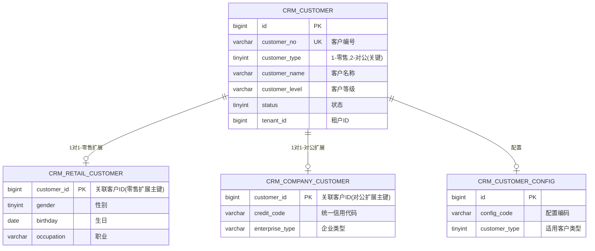

# 客户画像系统数据库设计方案说明

**版本**: v1.0
**日期**: 2025-10-27
**数据库**: MySQL 8.0+
**表数量**: 65张核心表

---

## 一、整体思路与方案

### 1.1 核心设计理念

本系统采用**"统一主表 + 差异扩展"**的设计模式，实现零售客户和对公客户的融合管理。

```
核心理念：
┌─────────────────────────────────────────┐
│  统一客户主表 (CRM_CUSTOMER)            │
│  - customer_type: 1=零售, 2=对公        │
│  - 21项共有信息统一管理                  │
└─────────────────────────────────────────┘
           ↓                    ↓
┌──────────────────┐  ┌──────────────────┐
│  零售客户扩展表   │  │  对公客户扩展表   │
│  (8项特有信息)    │  │  (16项特有信息)   │
└──────────────────┘  └──────────────────┘
```

### 1.2 零售与对公客户信息处理策略

#### 方案一：共有信息统一表结构（21项）

**设计策略**：零售客户和对公客户共有的业务信息使用**统一表结构**

**实现方式**：
- 通过 `customer_type` 字段区分客户类型（1=零售，2=对公）
- 同一张表同时存储零售和对公客户的数据
- 业务逻辑通过 `customer_type` 过滤处理

**适用范围**：
- 客户管理：归属、转移、历史
- 业务数据：账户、产品、授信、签约、担保、交易
- 客户评价：评级、贡献度、信用
- 营销服务：营销活动、需求、接触轨迹、产品推荐
- 关系网络：知识图谱、标签体系
- 行为数据：线上行为、重要事件

**优势**：
- ✅ 统一管理，避免数据冗余
- ✅ 共有业务逻辑复用（如账户管理、交易处理）
- ✅ 便于跨客户类型统计分析（如全行AUM、全行交易量）
- ✅ 简化系统维护（一套代码处理两类客户）

**数据量占比**：37张表（56.9%）

#### 方案二：特有信息独立扩展表

**设计策略**：零售和对公客户的**特有属性**使用独立扩展表

**零售客户特有（8项）**：
```
个人基础信息：
├── 证件信息（支持多证件）
├── 工作信息（在职信息）
├── 经营信息（经营主体）
└── 家庭信息（家庭成员）

个人偏好与权益：
├── 偏好设置（风险偏好、兴趣爱好）
├── 积分管理（积分累计与消费）
├── 卡券管理（优惠券）
└── 礼品管理（礼品兑换）

个人管理：
├── 大事记（重要事件台账）
├── 投诉管理（主要针对零售）
└── 提醒信息（主要针对零售）
```

**对公客户特有（16项）**：
```
企业基础信息（行内数据，8项）：
├── 组织架构（树形结构）
├── 地址信息（注册、经营、办公地址）
├── 联系人信息（分类联系人）
├── 股票信息（上市公司）
├── 债券信息（债券发行）
├── 财务信息（资产负债表、利润表、现金流量表）
├── 项目信息（企业项目台账）
└── 他行信息（与其他银行合作）

企业外部信息（行外数据，8项）：
├── 工商信息（企业注册、变更）
├── 股东信息（股权结构）
├── 高管信息（实控人、高管）
├── 水电费信息（经营活跃度）
├── 外部评级（评级机构）
├── 风险提示（风险预警）
├── 风险信息（行政处罚、失信被执行）
└── 供应链信息（上下游企业）
```

**优势**：
- ✅ 清晰分离零售和对公客户的特有属性
- ✅ 易于维护和扩展各自特有字段
- ✅ 支持不同客户类型的独立业务逻辑
- ✅ 避免主表字段过多，保持主表简洁

**数据量占比**：
- 零售特有：12张表（18.5%）
- 对公特有：15张表（23.1%）

#### 方案三：外部数据混合缓存策略

**设计背景**：对公客户高度依赖外部数据（工商、股东、风险等）

**实现方式**：
- 本地缓存 + 定期刷新
- 使用 `cache_time` 和 `expire_time` 管理缓存有效期
- 支持手动刷新和自动刷新

**缓存管理字段**：
```sql
cache_time    DATETIME  -- 缓存时间
expire_time   DATETIME  -- 过期时间
data_source   VARCHAR   -- 数据来源（如"企查查"、"天眼查"）
refresh_status TINYINT  -- 刷新状态（0=未刷新，1=刷新中，2=刷新成功，3=刷新失败）
```

---

## 二、共有信息与特有信息处理

### 2.1 共有信息处理策略（37张表）

**核心原则**：一张表同时服务零售和对公客户

**典型表结构示例**：
```sql
CREATE TABLE crm_customer_account (
  id BIGINT PRIMARY KEY,
  customer_id BIGINT NOT NULL COMMENT '客户ID（关联主表）',
  account_type INT COMMENT '账户类型',
  account_no VARCHAR(50) COMMENT '账户号',
  balance DECIMAL(18,2) COMMENT '账户余额',
  -- 共有字段：零售和对公都有账户
  -- 通过 customer_id 关联主表，主表的 customer_type 区分客户类型
) COMMENT '客户账户表（零售+对公共用）';
```

**查询示例**：
```sql
-- 查询零售客户的所有账户
SELECT a.*
FROM crm_customer_account a
JOIN crm_customer c ON a.customer_id = c.id
WHERE c.customer_type = 1;

-- 查询对公客户的所有账户
SELECT a.*
FROM crm_customer_account a
JOIN crm_customer c ON a.customer_id = c.id
WHERE c.customer_type = 2;

-- 统计全行客户账户数量（跨客户类型）
SELECT c.customer_type, COUNT(*) as account_count
FROM crm_customer_account a
JOIN crm_customer c ON a.customer_id = c.id
GROUP BY c.customer_type;
```

**共有信息模块列表**：
1. **客户管理**（3张）：归属管理、归属历史、归属转移
2. **业务数据**（10张）：账户、产品、授信、签约、担保、交易、流水等
3. **客户评价**（5张）：评级、评级历史、贡献度、信用
4. **营销服务**（5张）：营销活动、需求、接触轨迹、营销计划、营销效果
5. **关系网络**（5张）：知识图谱类型、客户关系、标签分类、标签、客户标签
6. **行为数据**（3张）：线上行为、重要事件、统计快照

### 2.2 特有信息处理策略（27张表）

**核心原则**：通过扩展表实现差异化管理

**零售客户扩展表关联方式**：
```sql
-- 零售客户扩展表（1对1关系）
CREATE TABLE crm_retail_customer (
  customer_id BIGINT PRIMARY KEY COMMENT '客户ID（主键=外键）',
  gender TINYINT COMMENT '性别',
  birthday DATE COMMENT '生日',
  -- 其他零售特有字段
  FOREIGN KEY (customer_id) REFERENCES crm_customer(id)
) COMMENT '零售客户扩展表';

-- 证件信息表（1对多关系）
CREATE TABLE crm_customer_identity (
  id BIGINT PRIMARY KEY,
  customer_id BIGINT NOT NULL COMMENT '客户ID（关联零售客户）',
  identity_type VARCHAR(20) COMMENT '证件类型（身份证、护照等）',
  identity_no VARCHAR(100) COMMENT '证件号码（加密）',
  FOREIGN KEY (customer_id) REFERENCES crm_retail_customer(customer_id)
) COMMENT '客户证件信息表（零售特有）';
```

**对公客户扩展表关联方式**：
```sql
-- 对公客户扩展表（1对1关系）
CREATE TABLE crm_company_customer (
  customer_id BIGINT PRIMARY KEY COMMENT '客户ID（主键=外键）',
  credit_code VARCHAR(50) COMMENT '统一社会信用代码',
  enterprise_type VARCHAR(50) COMMENT '企业类型',
  registered_capital DECIMAL(18,2) COMMENT '注册资本',
  -- 其他对公特有字段
  FOREIGN KEY (customer_id) REFERENCES crm_customer(id)
) COMMENT '对公客户扩展表';

-- 组织架构表（1对多关系，树形结构）
CREATE TABLE crm_company_organization (
  id BIGINT PRIMARY KEY,
  customer_id BIGINT NOT NULL COMMENT '客户ID（关联对公客户）',
  parent_id BIGINT COMMENT '上级组织ID',
  org_name VARCHAR(100) COMMENT '组织名称',
  FOREIGN KEY (customer_id) REFERENCES crm_company_customer(customer_id)
) COMMENT '企业组织架构表（对公特有）';

-- 财务信息表（1对多关系，JSON存储完整财务数据）
CREATE TABLE crm_company_finance (
  id BIGINT PRIMARY KEY,
  customer_id BIGINT NOT NULL COMMENT '客户ID（关联对公客户）',
  fiscal_year INT COMMENT '财务年度',
  balance_sheet JSON COMMENT '资产负债表',
  profit_statement JSON COMMENT '利润表',
  cash_flow JSON COMMENT '现金流量表',
  FOREIGN KEY (customer_id) REFERENCES crm_company_customer(customer_id)
) COMMENT '企业财务信息表（对公特有）';
```

**查询示例**：
```sql
-- 查询零售客户完整信息（主表 + 扩展表）
SELECT c.*, r.*
FROM crm_customer c
LEFT JOIN crm_retail_customer r ON c.id = r.customer_id
WHERE c.customer_type = 1 AND c.id = 123456;

-- 查询对公客户完整信息（主表 + 扩展表 + 财务数据）
SELECT c.*, cc.*, f.*
FROM crm_customer c
LEFT JOIN crm_company_customer cc ON c.id = cc.customer_id
LEFT JOIN crm_company_finance f ON cc.customer_id = f.customer_id
WHERE c.customer_type = 2 AND c.id = 789012;
```

---

## 三、行为信息、现状信息、历史汇总信息处理

### 3.1 行为信息处理（实时/准实时数据）

**定义**：客户的动态行为数据，记录客户的操作轨迹

**涉及的表**：
1. **交易明细表**（`crm_customer_transaction`）- 分区表
2. **线上行为表**（`crm_customer_online_behavior`）- 分区表
3. **接触轨迹表**（`crm_customer_contact_record`）
4. **重要事件表**（`crm_customer_important_event`）

**处理策略**：

#### 策略一：分区表优化（针对大数据量表）

```sql
-- 交易明细表（按月分区）
CREATE TABLE crm_customer_transaction (
  id BIGINT,
  account_id BIGINT,
  transaction_time DATETIME NOT NULL,  -- 分区字段
  transaction_type VARCHAR(50),
  amount DECIMAL(18,2),
  -- 其他字段...
  PRIMARY KEY (id, transaction_time)
)
PARTITION BY RANGE COLUMNS(transaction_time) (
  PARTITION p202501 VALUES LESS THAN ('2025-02-01'),
  PARTITION p202502 VALUES LESS THAN ('2025-03-01'),
  PARTITION p202503 VALUES LESS THAN ('2025-04-01'),
  -- 后续分区...
  PARTITION pmax VALUES LESS THAN (MAXVALUE)
);
```

**分区优势**：
- ✅ 查询性能优化（分区裁剪）
- ✅ 历史数据归档方便（直接删除旧分区）
- ✅ 索引维护成本降低

#### 策略二：定期归档（保留热数据）

```sql
-- 查询近30天交易（只扫描近期分区）
SELECT *
FROM crm_customer_transaction
WHERE transaction_time >= DATE_SUB(NOW(), INTERVAL 30 DAY)
  AND account_id = 123456;

-- 归档旧数据（删除旧分区或移动到历史表）
ALTER TABLE crm_customer_transaction
DROP PARTITION p202401;  -- 删除2024年1月的分区
```

#### 策略三：实时同步（从核心系统同步）

```yaml
同步策略:
  交易数据: 实时同步（T+0，延迟 < 1分钟）
  线上行为: 准实时同步（T+5分钟批量导入）
  接触轨迹: 实时记录（手动录入或系统自动记录）
```

### 3.2 现状信息处理（当前时点数据）

**定义**：客户的当前状态数据，代表客户的最新情况

**涉及的表**：
1. **客户基本信息**（`crm_customer`、`crm_retail_customer`、`crm_company_customer`）
2. **账户信息**（`crm_customer_account`）
3. **产品持有**（`crm_customer_product`）
4. **授信信息**（`crm_customer_credit`）
5. **评级信息**（`crm_customer_rating`）
6. **贡献度信息**（`crm_customer_contribution`）
7. **积分信息**（`crm_customer_points`）

**处理策略**：

#### 策略一：主表存储最新值

```sql
-- 客户账户表（存储当前余额）
CREATE TABLE crm_customer_account (
  id BIGINT PRIMARY KEY,
  customer_id BIGINT,
  account_no VARCHAR(50),
  balance DECIMAL(18,2) COMMENT '当前余额（最新值）',
  last_transaction_time DATETIME COMMENT '最后交易时间',
  update_time DATETIME COMMENT '更新时间'
) COMMENT '客户账户表（现状数据）';

-- 客户评级表（存储当前评级）
CREATE TABLE crm_customer_rating (
  id BIGINT PRIMARY KEY,
  customer_id BIGINT,
  rating_level VARCHAR(20) COMMENT '当前评级（如AAA、AA等）',
  rating_date DATE COMMENT '评级日期',
  update_time DATETIME COMMENT '更新时间'
) COMMENT '客户评级表（现状数据）';
```

#### 策略二：定时快照更新

```sql
-- 账户流水快照表（每日快照）
CREATE TABLE crm_customer_account_flow (
  id BIGINT PRIMARY KEY,
  account_id BIGINT,
  snapshot_date DATE COMMENT '快照日期',
  balance DECIMAL(18,2) COMMENT '日末余额',
  daily_inflow DECIMAL(18,2) COMMENT '当日流入',
  daily_outflow DECIMAL(18,2) COMMENT '当日流出'
) COMMENT '账户流水快照表（每日定时生成）';
```

#### 策略三：实时更新机制

```sql
-- 触发器或应用层更新
-- 当交易发生时，同步更新账户余额
UPDATE crm_customer_account
SET balance = balance + ?,
    last_transaction_time = NOW(),
    update_time = NOW()
WHERE account_id = ?;
```

### 3.3 历史汇总信息处理（统计分析数据）

**定义**：对历史数据的汇总统计，用于趋势分析和决策支持

**涉及的表**：
1. **评级历史表**（`crm_customer_rating_history`）
2. **归属历史表**（`crm_customer_assignment_history`）
3. **贡献度明细表**（`crm_customer_contribution_detail`）
4. **统计快照表**（`crm_customer_statistics_snapshot`）- 分区表
5. **账户流水快照表**（`crm_customer_account_flow`）

**处理策略**：

#### 策略一：历史记录表（全量保留）

```sql
-- 评级历史表（记录每次评级变更）
CREATE TABLE crm_customer_rating_history (
  id BIGINT PRIMARY KEY,
  customer_id BIGINT,
  rating_level VARCHAR(20) COMMENT '历史评级',
  rating_date DATE COMMENT '评级日期',
  effective_date DATE COMMENT '生效日期',
  expiry_date DATE COMMENT '失效日期',
  create_time DATETIME COMMENT '记录创建时间'
) COMMENT '客户评级历史表（全量历史）';

-- 查询评级变化趋势
SELECT customer_id, rating_date, rating_level
FROM crm_customer_rating_history
WHERE customer_id = 123456
ORDER BY rating_date DESC;
```

#### 策略二：定时快照表（按周期汇总）

```sql
-- 统计快照表（按日/周/月生成）
CREATE TABLE crm_customer_statistics_snapshot (
  id BIGINT,
  customer_id BIGINT,
  snapshot_date DATE NOT NULL,  -- 分区字段
  snapshot_type VARCHAR(20) COMMENT '快照类型（daily/weekly/monthly）',
  total_aum DECIMAL(18,2) COMMENT '资产总额',
  total_product_count INT COMMENT '产品总数',
  total_transaction_count INT COMMENT '交易总笔数',
  total_transaction_amount DECIMAL(18,2) COMMENT '交易总金额',
  -- 其他统计字段...
  PRIMARY KEY (id, snapshot_date)
)
PARTITION BY RANGE COLUMNS(snapshot_date) (
  PARTITION p202501 VALUES LESS THAN ('2025-02-01'),
  -- 后续分区...
);

-- 定时任务生成快照（每日凌晨1点执行）
INSERT INTO crm_customer_statistics_snapshot (
  customer_id, snapshot_date, snapshot_type, total_aum, ...
)
SELECT
  c.id,
  CURDATE(),
  'daily',
  SUM(a.balance),
  ...
FROM crm_customer c
JOIN crm_customer_account a ON c.id = a.customer_id
GROUP BY c.id;
```

#### 策略三：汇总明细表（按维度汇总）

```sql
-- 贡献度明细表（按贡献类型汇总）
CREATE TABLE crm_customer_contribution_detail (
  id BIGINT PRIMARY KEY,
  contribution_id BIGINT COMMENT '关联贡献度主表',
  contribution_type VARCHAR(50) COMMENT '贡献类型（存款、理财、贷款等）',
  contribution_value DECIMAL(18,2) COMMENT '贡献值',
  weight DECIMAL(5,2) COMMENT '权重',
  create_time DATETIME
) COMMENT '客户贡献度明细表（按类型汇总）';

-- 查询客户贡献度构成
SELECT contribution_type, SUM(contribution_value) as total_value
FROM crm_customer_contribution_detail
WHERE contribution_id = ?
GROUP BY contribution_type;
```

#### 策略四：数据生命周期管理

```yaml
数据保留策略:
  行为数据（交易、行为）:
    - 热数据: 近3个月（在线查询）
    - 温数据: 3-12个月（在线查询，分区表）
    - 冷数据: 1年以上（归档到历史库或删除旧分区）

  现状数据（账户、产品）:
    - 永久保留（持续更新最新值）

  历史汇总数据（快照、历史）:
    - 日快照: 保留3年
    - 周快照: 保留5年
    - 月快照: 永久保留
    - 历史记录: 永久保留
```

---

## 四、完整ER图

### 4.1 核心主表和扩展关系



### 4.2 共有信息表 - 客户管理、业务数据、评价

```mermaid
erDiagram
    %% ============================================
    %% 客户管理层（共有-3张）
    %% ============================================
    CRM_CUSTOMER ||--o{ CRM_CUSTOMER_ASSIGNMENT : "1对多-归属"
    CRM_CUSTOMER_ASSIGNMENT ||--o{ CRM_CUSTOMER_ASSIGNMENT_HISTORY : "1对多-归属历史"
    CRM_CUSTOMER_ASSIGNMENT ||--o{ CRM_CUSTOMER_ASSIGNMENT_TRANSFER : "1对多-归属转移"

    %% ============================================
    %% 业务数据层（共有-10张）
    %% ============================================
    CRM_CUSTOMER ||--o{ CRM_CUSTOMER_ACCOUNT : "1对多-账户"
    CRM_CUSTOMER ||--o{ CRM_CUSTOMER_PRODUCT : "1对多-产品"
    CRM_CUSTOMER ||--o{ CRM_CUSTOMER_CREDIT : "1对多-授信"
    CRM_CUSTOMER ||--o{ CRM_CUSTOMER_CONTRACT : "1对多-签约"
    CRM_CUSTOMER ||--o{ CRM_CUSTOMER_GUARANTEE : "1对多-担保"

    CRM_CUSTOMER_ACCOUNT ||--o{ CRM_CUSTOMER_TRANSACTION : "1对多-交易(分区)"
    CRM_CUSTOMER_ACCOUNT ||--o{ CRM_CUSTOMER_ACCOUNT_FLOW : "1对多-流水快照"

    CRM_CUSTOMER_CREDIT ||--o{ CRM_CUSTOMER_CREDIT_DETAIL : "1对多-授信明细"
    CRM_CUSTOMER_CONTRACT ||--o{ CRM_CUSTOMER_CONTRACT_PRODUCT : "1对多-签约产品"
    CRM_CUSTOMER_GUARANTEE ||--o{ CRM_CUSTOMER_GUARANTEE_ITEM : "1对多-担保明细"

    %% ============================================
    %% 客户评价层（共有-5张）
    %% ============================================
    CRM_CUSTOMER ||--o{ CRM_CUSTOMER_RATING : "1对多-评级"
    CRM_CUSTOMER ||--o{ CRM_CUSTOMER_CONTRIBUTION : "1对多-贡献度"
    CRM_CUSTOMER ||--o{ CRM_CUSTOMER_CREDIT_INFO : "1对多-信用"

    CRM_CUSTOMER_RATING ||--o{ CRM_CUSTOMER_RATING_HISTORY : "1对多-评级历史"
    CRM_CUSTOMER_CONTRIBUTION ||--o{ CRM_CUSTOMER_CONTRIBUTION_DETAIL : "1对多-贡献明细"

    %% 实体定义
    CRM_CUSTOMER {
        bigint id PK
        varchar customer_no UK
        tinyint customer_type
    }

    CRM_CUSTOMER_ASSIGNMENT {
        bigint id PK
        bigint customer_id FK
        tinyint assignment_type "1-主办,2-协办"
    }

    CRM_CUSTOMER_ACCOUNT {
        bigint id PK
        bigint customer_id FK
        int account_type
        varchar account_no UK
    }

    CRM_CUSTOMER_TRANSACTION {
        bigint id PK
        bigint account_id FK
        datetime transaction_time "分区字段"
    }

    CRM_CUSTOMER_RATING {
        bigint id PK
        bigint customer_id FK
        varchar rating_level
    }

    CRM_CUSTOMER_CONTRIBUTION {
        bigint id PK
        bigint customer_id FK
        decimal total_contribution
    }
```



### 4.3 共有信息表 - 营销服务、关系网络、行为数据

```mermaid
erDiagram
    %% ============================================
    %% 营销服务层（共有-5张+零售特有3张）
    %% ============================================
    CRM_CUSTOMER ||--o{ CRM_CUSTOMER_MARKETING : "1对多-营销活动(共有)"
    CRM_CUSTOMER ||--o{ CRM_CUSTOMER_DEMAND : "1对多-需求(共有)"
    CRM_CUSTOMER ||--o{ CRM_CUSTOMER_CONTACT_RECORD : "1对多-接触轨迹(共有)"
    CRM_CUSTOMER ||--o{ CRM_CUSTOMER_MARKETING_PLAN : "1对多-营销计划(共有)"
    CRM_CUSTOMER ||--o{ CRM_CUSTOMER_MARKETING_EFFECT : "1对多-营销效果(共有)"

    CRM_CUSTOMER ||--o{ CRM_PRODUCT_RECOMMEND : "1对多-产品推荐(共有)"
    CRM_CUSTOMER ||--o{ CRM_CUSTOMER_COMPLAINT : "1对多-投诉(零售为主)"
    CRM_CUSTOMER ||--o{ CRM_CUSTOMER_REMINDER : "1对多-提醒(零售为主)"

    %% ============================================
    %% 关系网络层（共有-5张）
    %% ============================================
    CRM_CUSTOMER_RELATION_TYPE ||--o{ CRM_CUSTOMER_RELATION : "1对多-关系"
    CRM_CUSTOMER ||--o{ CRM_CUSTOMER_RELATION : "1对多-客户关系"

    CRM_TAG_CATEGORY ||--o{ CRM_TAG : "1对多-标签"
    CRM_TAG ||--o{ CRM_CUSTOMER_TAG : "1对多-客户标签"
    CRM_CUSTOMER ||--o{ CRM_CUSTOMER_TAG : "1对多-标签关联"

    %% ============================================
    %% 行为数据层（共有-3张）
    %% ============================================
    CRM_CUSTOMER ||--o{ CRM_CUSTOMER_ONLINE_BEHAVIOR : "1对多-线上行为(分区)"
    CRM_CUSTOMER ||--o{ CRM_CUSTOMER_IMPORTANT_EVENT : "1对多-重要事件"
    CRM_CUSTOMER ||--o{ CRM_CUSTOMER_STATISTICS_SNAPSHOT : "1对多-统计快照(分区)"

    %% 实体定义
    CRM_CUSTOMER {
        bigint id PK
        varchar customer_no UK
    }

    CRM_CUSTOMER_MARKETING {
        bigint id PK
        bigint customer_id FK
        bigint activity_id
    }

    CRM_CUSTOMER_TAG {
        bigint id PK
        bigint customer_id FK
        bigint tag_id FK
        tinyint tag_source "1-系统,2-人工"
    }

    CRM_TAG_CATEGORY {
        bigint id PK
        varchar category_name
    }

    CRM_TAG {
        bigint id PK
        bigint category_id FK
        varchar tag_name
    }

    CRM_CUSTOMER_RELATION {
        bigint id PK
        bigint customer_id FK "客户A"
        bigint related_customer_id "客户B"
        bigint relation_type_id FK
    }

    CRM_CUSTOMER_ONLINE_BEHAVIOR {
        bigint id PK
        bigint customer_id FK
        datetime behavior_time "分区字段"
    }
```



### 4.4 零售客户特有表（12张）

```mermaid
erDiagram
    %% ============================================
    %% 零售客户特有 - 个人基础信息（4张）
    %% ============================================
    CRM_RETAIL_CUSTOMER ||--o{ CRM_CUSTOMER_IDENTITY : "1对多-证件"
    CRM_RETAIL_CUSTOMER ||--o{ CRM_CUSTOMER_WORK : "1对多-工作"
    CRM_RETAIL_CUSTOMER ||--o{ CRM_CUSTOMER_BUSINESS : "1对多-经营"

    %% ============================================
    %% 零售客户特有 - 家庭信息（2张）
    %% ============================================
    CRM_RETAIL_CUSTOMER ||--|| CRM_CUSTOMER_FAMILY : "1对1-家庭"
    CRM_CUSTOMER_FAMILY ||--o{ CRM_CUSTOMER_FAMILY_MEMBER : "1对多-家庭成员"

    %% ============================================
    %% 零售客户特有 - 个人偏好与管理（2张）
    %% ============================================
    CRM_RETAIL_CUSTOMER ||--|| CRM_CUSTOMER_PREFERENCE : "1对1-偏好"
    CRM_RETAIL_CUSTOMER ||--o{ CRM_CUSTOMER_EVENT : "1对多-大事记"

    %% ============================================
    %% 零售客户特有 - 权益积分（4张）
    %% ============================================
    CRM_RETAIL_CUSTOMER ||--|| CRM_CUSTOMER_POINTS : "1对1-积分"
    CRM_RETAIL_CUSTOMER ||--o{ CRM_CUSTOMER_COUPON : "1对多-卡券"
    CRM_RETAIL_CUSTOMER ||--o{ CRM_CUSTOMER_GIFT : "1对多-礼品"
    CRM_RETAIL_CUSTOMER ||--o{ CRM_CUSTOMER_GIFT_ORDER : "1对多-礼品订单"

    %% 实体定义
    CRM_RETAIL_CUSTOMER {
        bigint customer_id PK "主键-关联客户ID"
        tinyint gender
        date birthday
    }

    CRM_CUSTOMER_IDENTITY {
        bigint id PK
        bigint customer_id FK
        varchar identity_type
        varchar identity_no "加密"
    }

    CRM_CUSTOMER_FAMILY {
        bigint customer_id PK "主键-关联客户ID"
        int family_member_count
        decimal family_annual_income
    }

    CRM_CUSTOMER_FAMILY_MEMBER {
        bigint id PK
        bigint family_id FK
        varchar member_name
        varchar relation_type
    }

    CRM_CUSTOMER_PREFERENCE {
        bigint customer_id PK "主键-关联客户ID"
        tinyint risk_preference
        varchar hobbies
    }

    CRM_CUSTOMER_POINTS {
        bigint customer_id PK "主键-关联客户ID"
        int total_points
        int available_points
    }

    CRM_CUSTOMER_COUPON {
        bigint id PK
        bigint customer_id FK
        varchar coupon_code
        date expire_date
    }
```



### 4.5 对公客户特有表（15张）

```mermaid
erDiagram
    %% ============================================
    %% 对公客户特有 - 企业基础信息-行内（8张）
    %% ============================================
    CRM_COMPANY_CUSTOMER ||--o{ CRM_COMPANY_ORGANIZATION : "1对多-组织架构"
    CRM_COMPANY_CUSTOMER ||--o{ CRM_COMPANY_ADDRESS : "1对多-地址"
    CRM_COMPANY_CUSTOMER ||--o{ CRM_COMPANY_CONTACT : "1对多-联系人"
    CRM_COMPANY_CUSTOMER ||--o{ CRM_COMPANY_STOCK : "1对多-股票"
    CRM_COMPANY_CUSTOMER ||--o{ CRM_COMPANY_BOND : "1对多-债券"
    CRM_COMPANY_CUSTOMER ||--o{ CRM_COMPANY_FINANCE : "1对多-财务"
    CRM_COMPANY_CUSTOMER ||--o{ CRM_COMPANY_PROJECT : "1对多-项目"
    CRM_COMPANY_CUSTOMER ||--o{ CRM_COMPANY_OTHER_BANK : "1对多-他行"

    %% ============================================
    %% 对公客户特有 - 企业外部信息-行外（7张）
    %% ============================================
    CRM_COMPANY_CUSTOMER ||--|| CRM_COMPANY_EXTERNAL : "1对1-外部数据汇总"

    CRM_COMPANY_EXTERNAL ||--o{ CRM_COMPANY_BUSINESS_INFO : "1对多-工商"
    CRM_COMPANY_EXTERNAL ||--o{ CRM_COMPANY_SHAREHOLDER : "1对多-股东"
    CRM_COMPANY_EXTERNAL ||--o{ CRM_COMPANY_EXECUTIVE : "1对多-高管"
    CRM_COMPANY_EXTERNAL ||--o{ CRM_COMPANY_UTILITY : "1对多-水电费"
    CRM_COMPANY_EXTERNAL ||--o{ CRM_COMPANY_RATING_EXTERNAL : "1对多-外部评级"
    CRM_COMPANY_EXTERNAL ||--o{ CRM_COMPANY_RISK_ALERT : "1对多-风险提示"
    CRM_COMPANY_EXTERNAL ||--o{ CRM_COMPANY_RISK_INFO : "1对多-风险信息"
    CRM_COMPANY_EXTERNAL ||--o{ CRM_COMPANY_SUPPLY_CHAIN : "1对多-供应链"

    %% 实体定义
    CRM_COMPANY_CUSTOMER {
        bigint customer_id PK "主键-关联客户ID"
        varchar credit_code "统一信用代码"
        decimal registered_capital
    }

    CRM_COMPANY_ORGANIZATION {
        bigint id PK
        bigint customer_id FK
        bigint parent_id "上级组织"
        varchar org_name
    }

    CRM_COMPANY_ADDRESS {
        bigint id PK
        bigint customer_id FK
        tinyint address_type
        varchar address
    }

    CRM_COMPANY_CONTACT {
        bigint id PK
        bigint customer_id FK
        varchar contact_name
        varchar position
    }

    CRM_COMPANY_FINANCE {
        bigint id PK
        bigint customer_id FK
        int fiscal_year
        json balance_sheet "资产负债表"
        json profit_statement "利润表"
    }

    CRM_COMPANY_EXTERNAL {
        bigint customer_id PK "主键-关联客户ID"
        datetime cache_time "缓存时间"
        datetime expire_time "过期时间"
    }

    CRM_COMPANY_BUSINESS_INFO {
        bigint id PK
        bigint external_id FK
        varchar legal_person "法人"
        date establish_date
    }

    CRM_COMPANY_SHAREHOLDER {
        bigint id PK
        bigint external_id FK
        varchar shareholder_name
        decimal shareholding_ratio
    }

    CRM_COMPANY_RISK_INFO {
        bigint id PK
        bigint external_id FK
        varchar risk_type
        datetime risk_date
    }

    CRM_COMPANY_SUPPLY_CHAIN {
        bigint id PK
        bigint external_id FK
        tinyint chain_type "1-上游,2-下游"
        varchar related_company
    }
```



---

## 五、设计特点总结

### 5.1 关键设计决策

| 问题 | 解决方案 | 优势 |
|------|---------|------|
| 零售vs对公客户 | 统一主表 + 差异扩展 | 共有业务统一管理，特有业务独立扩展 |
| 共有vs特有信息 | 21项共有信息统一表，27项特有信息独立扩展表 | 避免冗余，易于维护 |
| 大数据量表 | 分区表（按月RANGE分区） | 查询优化，历史数据归档方便 |
| 外部数据 | 混合缓存策略（cache_time + expire_time） | 降低外部接口调用成本 |
| 行为数据 | 实时同步 + 分区表 + 定期归档 | 保留热数据，归档冷数据 |
| 现状数据 | 主表存储最新值 + 定时快照 | 快速查询当前状态 |
| 历史汇总 | 历史表 + 快照表 + 汇总明细表 | 支持趋势分析和决策支持 |

### 5.2 表数量分布

```
总表数: 65张
├── 共有信息表: 37张 (56.9%)
│   ├── 客户主表: 1张
│   ├── 客户管理: 3张
│   ├── 业务数据: 10张
│   ├── 客户评价: 5张
│   ├── 营销服务: 5张
│   ├── 关系网络: 5张
│   ├── 行为数据: 3张
│   └── 配置管理: 1张
├── 零售特有表: 12张 (18.5%)
│   ├── 个人基础: 4张
│   ├── 家庭信息: 2张
│   ├── 个人偏好: 2张
│   └── 权益积分: 4张
└── 对公特有表: 15张 (23.1%)
    ├── 行内数据: 8张
    └── 行外数据: 7张
```

### 5.3 分区表（3张）

1. `crm_customer_transaction` - 交易明细表（按月分区）
2. `crm_customer_online_behavior` - 线上行为表（按月分区）
3. `crm_customer_statistics_snapshot` - 统计快照表（按月分区）

### 5.4 核心技术特性

- ✅ **多租户隔离**：所有表包含 `tenant_id` 字段
- ✅ **数据权限控制**：基于角色和部门的行级权限
- ✅ **敏感数据加密**：证件号、手机号等敏感字段加密存储
- ✅ **软删除**：所有表包含 `deleted` 字段
- ✅ **审计日志**：包含 `creator`、`create_time`、`updater`、`update_time` 字段

---

**文档结束**
