# 智能陪练模块 - 数据库ER图

## 概述

本文档描述智能陪练模块的数据库设计，包含以下核心功能模块：
1. 角色扮演对练
2. 评估与打分
3. 销售套路、技巧、剧本管理
4. 后台管理
5. 工作流编排

## ER图

```mermaid
erDiagram
    %% ==================== 1. 虚拟客户模块 ====================
    VIRTUAL_CUSTOMER_TEMPLATE {
        bigint id PK "主键"
        varchar name "模板名称"
        text description "模板描述"
        int age_min "年龄范围-最小值"
        int age_max "年龄范围-最大值"
        varchar occupation "职业"
        varchar risk_preference "风险偏好(conservative/moderate/aggressive)"
        decimal income_level "收入水平"
        decimal asset_scale "资产规模"
        varchar investment_experience "投资经验(none/beginner/intermediate/expert)"
        text personality_traits "性格特征(JSON)"
        text custom_attributes "自定义属性(JSON)"
        tinyint status "状态(0-禁用,1-启用)"
        varchar creator "创建者"
        datetime create_time "创建时间"
        varchar updater "更新者"
        datetime update_time "更新时间"
        bit deleted "是否删除"
        bigint tenant_id "租户ID"
    }

    %% ==================== 2. 场景与剧本模块 ====================
    PRACTICE_SCENE {
        bigint id PK "主键"
        varchar name "场景名称"
        varchar scene_type "场景类型(prospecting/needs_discovery/objection_handling/closing/complex)"
        text description "场景描述"
        text target_skills "目标技能(JSON数组)"
        text keywords "关键词(JSON数组)"
        int difficulty_level "难度级别(1-5)"
        tinyint status "状态(0-禁用,1-启用)"
        varchar creator "创建者"
        datetime create_time "创建时间"
        varchar updater "更新者"
        datetime update_time "更新时间"
        bit deleted "是否删除"
        bigint tenant_id "租户ID"
    }

    SALES_SCRIPT {
        bigint id PK "主键"
        varchar name "剧本名称"
        bigint scene_id FK "关联场景ID"
        bigint current_version_id FK "当前版本ID"
        text description "剧本描述"
        text tags "标签(JSON数组)"
        tinyint status "状态(0-禁用,1-启用)"
        varchar creator "创建者"
        datetime create_time "创建时间"
        varchar updater "更新者"
        datetime update_time "更新时间"
        bit deleted "是否删除"
        bigint tenant_id "租户ID"
    }

    SCRIPT_VERSION {
        bigint id PK "主键"
        bigint script_id FK "剧本ID"
        varchar version_number "版本号"
        text change_log "变更日志"
        text content "剧本内容(JSON)"
        decimal avg_compliance_score "平均合规得分"
        int usage_count "使用次数"
        tinyint is_active "是否当前版本"
        varchar creator "创建者"
        datetime create_time "创建时间"
        varchar updater "更新者"
        datetime update_time "更新时间"
        bit deleted "是否删除"
        bigint tenant_id "租户ID"
    }

    SCRIPT_BRANCH {
        bigint id PK "主键"
        bigint version_id FK "版本ID"
        varchar branch_name "分支名称"
        varchar trigger_condition "触发条件"
        text content "分支内容(JSON)"
        bigint parent_branch_id FK "父分支ID"
        int sequence "排序"
        varchar creator "创建者"
        datetime create_time "创建时间"
        varchar updater "更新者"
        datetime update_time "更新时间"
        bit deleted "是否删除"
        bigint tenant_id "租户ID"
    }

    CASE_LIBRARY {
        bigint id PK "主键"
        varchar title "案例标题"
        varchar case_type "案例类型"
        text background "背景描述"
        text problem "问题描述"
        text solution "解决方案"
        text outcome "结果"
        text lessons_learned "经验教训"
        varchar difficulty "难度(easy/medium/hard)"
        tinyint status "状态(0-禁用,1-启用)"
        varchar creator "创建者"
        datetime create_time "创建时间"
        varchar updater "更新者"
        datetime update_time "更新时间"
        bit deleted "是否删除"
        bigint tenant_id "租户ID"
    }

    CASE_TAG {
        bigint id PK "主键"
        varchar tag_name "标签名称"
        varchar tag_type "标签类型(scene/customer/strategy)"
        varchar color "标签颜色"
        int sort "排序"
        varchar creator "创建者"
        datetime create_time "创建时间"
        varchar updater "更新者"
        datetime update_time "更新时间"
        bit deleted "是否删除"
        bigint tenant_id "租户ID"
    }

    CASE_TAG_RELATION {
        bigint id PK "主键"
        bigint case_id FK "案例ID"
        bigint tag_id FK "标签ID"
        varchar creator "创建者"
        datetime create_time "创建时间"
        bit deleted "是否删除"
        bigint tenant_id "租户ID"
    }

    %% ==================== 3. 销售套路与技巧模块 ====================
    SALES_ROUTINE {
        bigint id PK "主键"
        varchar name "套路名称"
        text description "描述"
        text steps "步骤(JSON数组)"
        text applicable_scenes "适用场景(JSON数组)"
        text related_compliance_rules "关联合规规则(JSON数组)"
        text related_products "关联产品(JSON数组)"
        tinyint status "状态(0-禁用,1-启用)"
        varchar creator "创建者"
        datetime create_time "创建时间"
        varchar updater "更新者"
        datetime update_time "更新时间"
        bit deleted "是否删除"
        bigint tenant_id "租户ID"
    }

    SALES_SKILL {
        bigint id PK "主键"
        varchar name "技巧名称"
        varchar skill_type "技巧类型"
        text description "描述"
        text template_content "话术模板"
        text example "示例"
        text related_compliance_rules "关联合规规则(JSON数组)"
        text related_knowledge "关联产品知识(JSON数组)"
        tinyint status "状态(0-禁用,1-启用)"
        varchar creator "创建者"
        datetime create_time "创建时间"
        varchar updater "更新者"
        datetime update_time "更新时间"
        bit deleted "是否删除"
        bigint tenant_id "租户ID"
    }

    COMPLIANCE_RULE {
        bigint id PK "主键"
        varchar rule_code "规则编码"
        varchar rule_name "规则名称"
        text description "规则描述"
        text prohibited_terms "禁用术语(JSON数组)"
        text warning_terms "警告术语(JSON数组)"
        varchar severity "严重程度(low/medium/high/critical)"
        text suggestion "改进建议"
        tinyint status "状态(0-禁用,1-启用)"
        varchar creator "创建者"
        datetime create_time "创建时间"
        varchar updater "更新者"
        datetime update_time "更新时间"
        bit deleted "是否删除"
        bigint tenant_id "租户ID"
    }

    %% ==================== 4. 对练会话模块 ====================
    PRACTICE_SESSION {
        bigint id PK "主键"
        varchar session_code "会话编号"
        bigint user_id FK "用户ID"
        bigint scene_id FK "场景ID"
        bigint script_id FK "剧本ID"
        bigint script_version_id FK "剧本版本ID"
        bigint virtual_customer_id FK "虚拟客户ID"
        text virtual_customer_profile "虚拟客户画像(JSON)"
        varchar session_status "会话状态(ongoing/completed/abandoned)"
        datetime start_time "开始时间"
        datetime end_time "结束时间"
        int duration_seconds "持续时长(秒)"
        decimal overall_score "总分"
        varchar creator "创建者"
        datetime create_time "创建时间"
        varchar updater "更新者"
        datetime update_time "更新时间"
        bit deleted "是否删除"
        bigint tenant_id "租户ID"
    }

    PRACTICE_DIALOGUE {
        bigint id PK "主键"
        bigint session_id FK "会话ID"
        varchar speaker_role "发言角色(user/virtual_customer)"
        text content "对话内容"
        text emotion "情绪(JSON)"
        datetime dialogue_time "对话时间"
        int sequence "对话序号"
        text compliance_check_result "合规检查结果(JSON)"
        varchar creator "创建者"
        datetime create_time "创建时间"
        bit deleted "是否删除"
        bigint tenant_id "租户ID"
    }

    %% ==================== 5. 评估与打分模块 ====================
    EVALUATION_DIMENSION {
        bigint id PK "主键"
        varchar dimension_code "维度编码"
        varchar dimension_name "维度名称"
        text description "描述"
        int weight "权重"
        int sort "排序"
        tinyint status "状态(0-禁用,1-启用)"
        varchar creator "创建者"
        datetime create_time "创建时间"
        varchar updater "更新者"
        datetime update_time "更新时间"
        bit deleted "是否删除"
        bigint tenant_id "租户ID"
    }

    EVALUATION_METRIC {
        bigint id PK "主键"
        bigint dimension_id FK "维度ID"
        varchar metric_code "指标编码"
        varchar metric_name "指标名称"
        text description "描述"
        int weight "权重"
        decimal max_score "最高分"
        text scoring_criteria "评分标准(JSON)"
        int sort "排序"
        tinyint status "状态(0-禁用,1-启用)"
        varchar creator "创建者"
        datetime create_time "创建时间"
        varchar updater "更新者"
        datetime update_time "更新时间"
        bit deleted "是否删除"
        bigint tenant_id "租户ID"
    }

    SESSION_EVALUATION {
        bigint id PK "主键"
        bigint session_id FK "会话ID"
        decimal total_score "总分"
        text dimension_scores "维度得分(JSON)"
        text radar_chart_data "雷达图数据(JSON)"
        text strengths "优势(JSON数组)"
        text weaknesses "弱点(JSON数组)"
        text compliance_issues "合规问题(JSON数组)"
        varchar creator "创建者"
        datetime create_time "创建时间"
        varchar updater "更新者"
        datetime update_time "更新时间"
        bit deleted "是否删除"
        bigint tenant_id "租户ID"
    }

    EVALUATION_DETAIL {
        bigint id PK "主键"
        bigint evaluation_id FK "评估ID"
        bigint dimension_id FK "维度ID"
        bigint metric_id FK "指标ID"
        decimal score "得分"
        text feedback "反馈"
        text evidence "证据(JSON)"
        varchar creator "创建者"
        datetime create_time "创建时间"
        bit deleted "是否删除"
        bigint tenant_id "租户ID"
    }

    IMPROVEMENT_SUGGESTION {
        bigint id PK "主键"
        bigint session_id FK "会话ID"
        bigint evaluation_id FK "评估ID"
        varchar suggestion_type "建议类型"
        varchar priority "优先级(low/medium/high)"
        text content "建议内容"
        text related_case "关联案例(JSON)"
        text related_resources "关联资源(JSON数组)"
        varchar creator "创建者"
        datetime create_time "创建时间"
        varchar updater "更新者"
        datetime update_time "更新时间"
        bit deleted "是否删除"
        bigint tenant_id "租户ID"
    }

    LEARNING_RESOURCE {
        bigint id PK "主键"
        varchar resource_type "资源类型(course/template/article/video)"
        varchar title "标题"
        text description "描述"
        text content "内容"
        varchar url "链接"
        text tags "标签(JSON数组)"
        text related_skills "关联技能(JSON数组)"
        tinyint status "状态(0-禁用,1-启用)"
        varchar creator "创建者"
        datetime create_time "创建时间"
        varchar updater "更新者"
        datetime update_time "更新时间"
        bit deleted "是否删除"
        bigint tenant_id "租户ID"
    }

    GROWTH_TRACK {
        bigint id PK "主键"
        bigint user_id FK "用户ID"
        bigint session_id FK "会话ID"
        decimal score "得分"
        text dimension_scores "各维度得分(JSON)"
        text high_frequency_issues "高频问题类型(JSON数组)"
        date practice_date "练习日期"
        varchar period_type "周期类型(daily/weekly/monthly/quarterly)"
        varchar creator "创建者"
        datetime create_time "创建时间"
        bit deleted "是否删除"
        bigint tenant_id "租户ID"
    }

    %% ==================== 6. 工作流编排模块 ====================
    WORKFLOW_CONFIG {
        bigint id PK "主键"
        varchar workflow_name "工作流名称"
        varchar workflow_type "工作流类型"
        text description "描述"
        text config_content "配置内容(JSON)"
        varchar hiagent_workflow_id "HiAgent工作流ID"
        tinyint is_editable "是否可编辑"
        tinyint status "状态(0-禁用,1-启用)"
        varchar creator "创建者"
        datetime create_time "创建时间"
        varchar updater "更新者"
        datetime update_time "更新时间"
        bit deleted "是否删除"
        bigint tenant_id "租户ID"
    }

    %% ==================== 7. 系统管理模块 ====================
    OPERATION_LOG {
        bigint id PK "主键"
        varchar module "模块"
        varchar operation_type "操作类型"
        varchar operation_desc "操作描述"
        bigint user_id FK "操作用户ID"
        varchar username "操作用户名"
        text request_params "请求参数(JSON)"
        text response_result "响应结果(JSON)"
        varchar ip_address "IP地址"
        varchar user_agent "用户代理"
        datetime operation_time "操作时间"
        int execution_time "执行时长(ms)"
        tinyint success "是否成功"
        text error_msg "错误信息"
        datetime create_time "创建时间"
        bit deleted "是否删除"
        bigint tenant_id "租户ID"
    }

    %% ==================== 关系定义 ====================
    PRACTICE_SESSION ||--o{ PRACTICE_DIALOGUE : "包含"
    PRACTICE_SESSION ||--|| SESSION_EVALUATION : "对应"
    PRACTICE_SESSION ||--o{ IMPROVEMENT_SUGGESTION : "产生"
    PRACTICE_SESSION ||--o{ GROWTH_TRACK : "记录"
    PRACTICE_SESSION }o--|| PRACTICE_SCENE : "基于"
    PRACTICE_SESSION }o--|| SALES_SCRIPT : "使用"
    PRACTICE_SESSION }o--|| SCRIPT_VERSION : "使用版本"
    PRACTICE_SESSION }o--|| VIRTUAL_CUSTOMER_TEMPLATE : "使用模板"

    SALES_SCRIPT ||--o{ SCRIPT_VERSION : "包含"
    SALES_SCRIPT }o--|| PRACTICE_SCENE : "关联"

    SCRIPT_VERSION ||--o{ SCRIPT_BRANCH : "包含"
    SCRIPT_BRANCH }o--o| SCRIPT_BRANCH : "父子关系"

    CASE_LIBRARY ||--o{ CASE_TAG_RELATION : "关联"
    CASE_TAG ||--o{ CASE_TAG_RELATION : "关联"

    SESSION_EVALUATION ||--o{ EVALUATION_DETAIL : "包含"
    SESSION_EVALUATION ||--o{ IMPROVEMENT_SUGGESTION : "产生"

    EVALUATION_DIMENSION ||--o{ EVALUATION_METRIC : "包含"
    EVALUATION_DIMENSION ||--o{ EVALUATION_DETAIL : "评估维度"
    EVALUATION_METRIC ||--o{ EVALUATION_DETAIL : "评估指标"
```

## 核心数据表说明

### 1. 虚拟客户模块
- **VIRTUAL_CUSTOMER_TEMPLATE**: 虚拟客户模板，用于配置虚拟客户的各种属性（年龄、职业、风险偏好等）

### 2. 场景与剧本模块
- **PRACTICE_SCENE**: 对练场景（拓客、需求挖掘、异议处理、促成签约等）
- **SALES_SCRIPT**: 销售剧本主表
- **SCRIPT_VERSION**: 剧本版本管理，支持版本对比与回退
- **SCRIPT_BRANCH**: 剧本情节分支，支持动态剧情
- **CASE_LIBRARY**: 多领域案例库
- **CASE_TAG**: 案例标签
- **CASE_TAG_RELATION**: 案例与标签的关联关系

### 3. 销售套路与技巧模块
- **SALES_ROUTINE**: 销售套路（如"三步促成法"）
- **SALES_SKILL**: 销售技巧（如"风险置换话术模板"）
- **COMPLIANCE_RULE**: 合规规则库

### 4. 对练会话模块
- **PRACTICE_SESSION**: 对练会话主表，记录每次对练的基本信息
- **PRACTICE_DIALOGUE**: 对话记录，记录每轮对话内容及情绪反馈

### 5. 评估与打分模块
- **EVALUATION_DIMENSION**: 评估维度（沟通逻辑、专业能力、合规表现等）
- **EVALUATION_METRIC**: 评估指标（维度下的具体指标）
- **SESSION_EVALUATION**: 会话评估结果
- **EVALUATION_DETAIL**: 评估明细
- **IMPROVEMENT_SUGGESTION**: 个性化改进建议
- **LEARNING_RESOURCE**: 学习资源（课程、模板等）
- **GROWTH_TRACK**: 成长轨迹记录

### 6. 工作流编排模块
- **WORKFLOW_CONFIG**: 工作流配置，对接HiAgent平台

### 7. 系统管理模块
- **OPERATION_LOG**: 操作日志

## 数据字典

### 枚举值说明

#### 风险偏好 (risk_preference)
- `conservative`: 保守型
- `moderate`: 稳健型
- `aggressive`: 进取型

#### 投资经验 (investment_experience)
- `none`: 无经验
- `beginner`: 初级
- `intermediate`: 中级
- `expert`: 专家

#### 场景类型 (scene_type)
- `prospecting`: 拓客
- `needs_discovery`: 需求挖掘
- `objection_handling`: 异议处理
- `closing`: 促成签约
- `complex`: 复杂场景

#### 会话状态 (session_status)
- `ongoing`: 进行中
- `completed`: 已完成
- `abandoned`: 已放弃

#### 发言角色 (speaker_role)
- `user`: 用户
- `virtual_customer`: 虚拟客户

#### 资源类型 (resource_type)
- `course`: 课程
- `template`: 模板
- `article`: 文章
- `video`: 视频

#### 周期类型 (period_type)
- `daily`: 每日
- `weekly`: 每周
- `monthly`: 每月
- `quarterly`: 每季度
