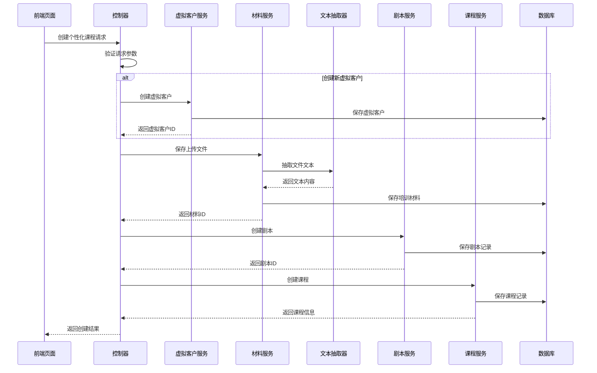

# 个性化课程创建服务设计文档

## 架构设计

### 整体架构

个性化课程创建服务采用分层架构设计，遵循项目现有的三层架构模式：

```
Controller Layer (Web层)
├── PracticePersonalizedCourseController
│   └── createPersonalizedCourse()
    ↓
Service Layer (业务层)
├── PracticeCourseService
├── PracticeScriptService
├── PracticeVirtualCustomerService
├── PracticeMaterialService
└── DocumentTextExtractor (新)
    ↓
Mapper Layer (数据访问层)
├── PracticeCourseMapper
├── PracticeScriptMapper
├── PracticeVirtualCustomerMapper
└── PracticeMaterialMapper
    ↓
Data Layer (数据层)
├── crm_practice_course
├── crm_practice_script
├── crm_practice_virtual_customer
└── crm_practice_material
```

### 核心组件设计

#### 1. 主控制器 - PracticePersonalizedCourseController
- **职责**: 接收前端请求，协调各服务完成个性化课程创建
- **主要接口**: `POST /admin-api/aicrm/practice-course/create-personalized`
- **特点**:
  - 使用事务管理确保数据一致性
  - 统一异常处理
  - 参数验证和权限控制

#### 2. 文档文本抽取器 - DocumentTextExtractor
- **职责**: 处理不同格式文件的文本内容抽取
- **支持格式**: Word (.doc/.docx), PDF (.pdf), Text (.txt)
- **技术栈**:
  - Apache POI (Word处理)
  - Apache PDFBox (PDF处理)
  - 原生 Java I/O (文本处理)

#### 3. 服务层扩展
- **PracticeVirtualCustomerService**: 添加快速创建虚拟客户方法
- **PracticeMaterialService**: 添加文件处理和内容抽取方法
- **PracticeScriptService**: 添加个性化剧本创建方法
- **PracticeCourseService**: 添加个性化课程创建方法

## 数据流设计

### 创建流程数据流



### 事务边界设计

采用声明式事务管理，确保整个创建流程的原子性：

```java
@Transactional(rollbackFor = Exception.class)
public PersonalizedCourseRespVO createPersonalizedCourse(CreatePersonalizedCourseReqVO reqVO) {
    // 1. 创建虚拟客户（如果需要）
    // 2. 处理文件上传和内容抽取
    // 3. 创建剧本记录
    // 4. 创建课程记录
    // 任何步骤失败都会触发完整回滚
}
```

## 技术选型说明

### 文本处理技术栈

#### Word 文档处理
- **技术**: Apache POI 5.2+
- **优势**:
  - 成熟稳定的开源库
  - 支持 .doc 和 .docx 格式
  - 丰富的文本抽取功能
- **注意事项**:
  - 需要处理复杂格式文档时的性能问题
  - 内存使用优化

#### PDF 文档处理
- **技术**: Apache PDFBox 3.0+
- **优势**:
  - 原生 Java 实现
  - 支持加密PDF处理
  - 良好的中文支持
- **注意事项**:
  - 某些复杂PDF可能抽取效果不佳
  - 需要处理图片PDF的OCR（可选功能）

#### 文本文档处理
- **技术**: 原生 Java I/O + BufferedReader
- **优势**:
  - 轻量级实现
  - 支持多种字符编码
  - 高性能处理

## 错误处理策略

### 分层错误处理

#### 1. 文件处理错误
```java
try {
    String content = extractText(file);
} catch (IOException e) {
    // 文件读取失败，记录日志但继续创建课程
    log.warn("文件文本抽取失败: {}", e.getMessage());
    content = ""; // 设置为空，不中断流程
}
```

#### 2. 数据验证错误
```java
if (StringUtils.isBlank(reqVO.getCourseName())) {
    throw exception(PRACTICE_COURSE_NAME_NOT_EXISTS);
}
```

#### 3. 业务逻辑错误
```java
if (!SUPPORTED_FILE_TYPES.contains(fileType)) {
    throw exception(PRACTICE_MATERIAL_UNSUPPORTED_FILE_TYPE);
}
```

### 错误信息设计
- **用户友好**: 提供清晰的错误提示信息
- **日志详细**: 记录详细的错误信息用于问题排查
- **状态码规范**: 使用标准的HTTP状态码

## 性能优化策略

### 文件处理优化

#### 1. 内存管理
```java
// 使用流式处理大文件，避免内存溢出
try (InputStream is = file.getInputStream();
     BufferedReader reader = new BufferedReader(new InputStreamReader(is, StandardCharsets.UTF_8))) {
    // 处理文件内容
}
```

#### 2. 异步处理考虑
对于大文件或大量文本抽取，考虑引入异步处理：

```java
@Async
public CompletableFuture<String> extractTextAsync(MultipartFile file) {
    // 异步文本抽取
}
```

#### 3. 缓存策略
- 文件处理结果缓存（如果相同文件多次上传）
- 字典数据缓存
- 用户权限信息缓存

## 安全考虑

### 文件安全
- **文件类型验证**: 严格限制允许上传的文件类型
- **文件大小限制**: 防止过大文件影响系统性能
- **病毒扫描**: 集成文件安全扫描（可选）
- **路径安全**: 防止路径遍历攻击

### 数据安全
- **输入验证**: 严格验证所有用户输入
- **SQL注入防护**: 使用MyBatis参数化查询
- **权限控制**: 确保只有授权用户可以创建课程
- **敏感信息**: 避免在日志中记录敏感信息

## 监控和日志

### 关键指标监控
- 文件处理成功率
- 文件处理耗时
- 课程创建成功率
- API调用频率和响应时间

### 日志策略
```java
// 关键操作日志
log.info("[createPersonalizedCourse] 用户{}开始创建个性化课程: {}",
         getCurrentUserId(), reqVO.getCourseName());

// 性能监控日志
long startTime = System.currentTimeMillis();
// ... 处理逻辑
log.info("[createPersonalizedCourse] 课程创建完成，耗时: {}ms",
         System.currentTimeMillis() - startTime);

// 错误日志
log.error("[createPersonalizedCourse] 课程创建失败", e);
```

## 扩展性设计

### 模块化设计
- 文本抽取器独立设计，便于支持新的文件格式
- 服务层松耦合，便于功能扩展
- 统一的错误处理机制

### 配置化
- 文件类型限制配置化
- 文件大小限制配置化
- 文本抽取参数配置化

### API版本控制
- 支持API版本演进
- 向后兼容性考虑
- 接口变更通知机制

## 测试策略

### 单元测试覆盖
- DocumentTextExtractor 的各种文件格式处理
- 各服务方法的边界条件测试
- 异常场景的处理测试

### 集成测试
- 完整的课程创建流程测试
- 数据库事务回滚测试
- 文件上传集成测试

### 性能测试
- 大文件处理性能测试
- 并发创建课程测试
- 长时间运行稳定性测试